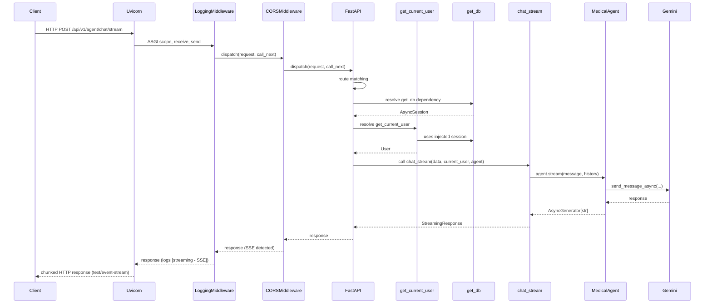

# Part III — FastAPI Deep Dive

## §14 ASGI vs WSGI

### WSGI — The Old World

WSGI (Web Server Gateway Interface, PEP 3333) is synchronous. A WSGI server calls your app as a plain callable: `response = app(environ, start_response)`. Every request blocks a worker thread for its entire duration. Django and Flask are WSGI.

### ASGI — The New World

ASGI (Asynchronous Server Gateway Interface) is asynchronous. The interface is: `await app(scope, receive, send)`. A single process can handle thousands of concurrent connections because I/O waits don't block a thread — they yield control back to the event loop.

```python
# Minimal ASGI app — no framework needed
async def app(scope, receive, send):
    if scope["type"] == "http":
        await send({"type": "http.response.start", "status": 200, "headers": []})
        await send({"type": "http.response.body", "body": b"Hello"})
```

FastAPI wraps Starlette, which is an ASGI framework. Uvicorn is the ASGI server.

### What `uvicorn[standard]` Adds

```bash
pip install uvicorn[standard]
# installs these extras:
# uvloop      — faster event loop (C extension, replaces asyncio's default)
# httptools   — faster HTTP/1.1 parser (C extension, replaces h11)
# websockets  — WebSocket support
```

| | `uvicorn` (plain) | `uvicorn[standard]` |
|--|------------------|---------------------|
| Event loop | `asyncio` (pure Python) | `uvloop` (libuv-based C) |
| HTTP parser | `h11` (pure Python) | `httptools` (C) |
| Speed gain | baseline | ~2–4x throughput |
| WebSockets | Not included | Included |

> **💡 Senior Tip:** On Windows, `uvloop` does not install (it requires POSIX). Your dev box runs without it, production Linux gets it. This is fine — functionality is identical, just slower in dev. The `uvicorn[standard]` extras are no-ops on Windows.

---

## §15 Request Lifecycle

Here is the full request path through MediAssist for `POST /api/v1/agent/chat/stream`:



### Middleware Execution Order

Middleware wraps the app like an onion. In `main.py`:

```python
# main.py
app.add_middleware(LoggingMiddleware)    # added second → outermost
app.add_middleware(CORSMiddleware, ...)  # added first → inner
```

Starlette processes middleware in **reverse registration order** — the last `add_middleware` call is the outermost layer (first to see the request, last to see the response). Counter-intuitive but documented.

```
Request:  LoggingMiddleware → CORSMiddleware → FastAPI router
Response: FastAPI router → CORSMiddleware → LoggingMiddleware
```

---

## §16 Routing & Path Operations

### `APIRouter`

Each module registers its own router, then `main.py` mounts them:

```python
# auth/router.py
router = APIRouter(prefix="/api/v1/auth", tags=["Authentication"])

# main.py
from auth.router import router as auth_router
app.include_router(auth_router)
```

`prefix` is prepended to every route in the router. `tags` group routes in OpenAPI docs.

### `response_model` — Separate Your DB Model from Your API Schema

```python
# auth/router.py
@router.get("/me", response_model=UserResponse)
async def get_me(current_user: User = Depends(get_current_user)) -> User:
    return current_user   # FastAPI serializes User → UserResponse automatically
```

`response_model=UserResponse` does three things:
1. **Filters** the response — fields in `User` but not in `UserResponse` are excluded (e.g., `hashed_password` is stripped)
2. **Validates** the response — catches bugs where your endpoint returns the wrong shape
3. **Documents** the response in OpenAPI

> **⚠️ Gotcha:** `response_model` validation runs on every response. If your Pydantic model has expensive validators, this costs CPU on every request. Use `response_model_exclude_unset=True` to skip unset optional fields in the serialization output.

### Status Codes

```python
from fastapi import status

@router.post("/register", status_code=status.HTTP_201_CREATED)
@router.delete("/users/{id}", status_code=status.HTTP_204_NO_CONTENT)
```

Use `status.HTTP_*` constants, not magic numbers. `204 No Content` means the response body MUST be empty — FastAPI enforces this when you declare it.

---

## §17 Pydantic v2 in FastAPI

Pydantic v2 was a complete rewrite (June 2023, Rust-based core). The API has breaking changes from v1. Your codebase uses `pydantic==2.9.2`.

### `BaseModel` — Your Dart `Freezed` Equivalent

```python
# auth/models.py
from pydantic import BaseModel, Field, field_validator, model_validator, ConfigDict
from datetime import datetime

class UserResponse(BaseModel):
    model_config = ConfigDict(from_attributes=True)  # allows ORM → Pydantic conversion

    id: str
    email: str
    full_name: str
    role: UserRole
    is_active: bool
    created_at: datetime
```

`from_attributes=True` (v2) replaces `orm_mode = True` (v1). It allows `UserResponse.model_validate(orm_user_object)` — Pydantic reads attributes instead of dict keys.

> **🔁 Dart Analogy:** `BaseModel` is equivalent to a `@freezed` class with `fromJson`/`toJson`. `model_validate(dict)` is `fromJson`. `model_dump()` is `toJson()`. The difference: Pydantic validates at runtime, Freezed validates at compile time.

### Validators

```python
from pydantic import field_validator, model_validator

class UserRegister(BaseModel):
    email: str
    password: str
    role: UserRole = UserRole.PATIENT

    @field_validator("password")   # v2 syntax
    @classmethod
    def validate_password(cls, v: str) -> str:
        if len(v) < 8:
            raise ValueError("Password must be at least 8 characters")
        if not any(c.isupper() for c in v):
            raise ValueError("Password must contain an uppercase letter")
        return v

    @model_validator(mode="after")   # runs after all fields are validated
    def check_email_matches_role(self) -> "UserRegister":
        if self.role == UserRole.ADMIN and not self.email.endswith("@mediassist.com"):
            raise ValueError("Admin accounts require a mediassist.com email")
        return self
```

> **⚠️ Gotcha — v1 → v2 Breaking Changes:**

| Feature | v1 | v2 |
|---------|----|----|
| ORM mode | `orm_mode = True` | `model_config = ConfigDict(from_attributes=True)` |
| Field validator | `@validator("field")` | `@field_validator("field")` (must be `@classmethod`) |
| Root validator | `@root_validator` | `@model_validator(mode="before"\|"after")` |
| Dict output | `.dict()` | `.model_dump()` |
| JSON output | `.json()` | `.model_dump_json()` |
| Copy | `.copy()` | `.model_copy()` |
| Schema | `.schema()` | `.model_json_schema()` |
| Construct (no validation) | `.construct()` | `.model_construct()` |
| Config class | `class Config:` | `model_config = ConfigDict(...)` |

In `auth/models.py`, the `validate_password` validator is commented out. If you uncomment it, make sure it uses `@field_validator` (v2) not `@validator` (v1 — will silently not run in v2).

### `model_dump` — Serialization

```python
user = UserUpdate(full_name="Ahmed", role=None, is_active=None)

user.model_dump()                    # {"full_name": "Ahmed", "role": None, "is_active": None}
user.model_dump(exclude_none=True)   # {"full_name": "Ahmed"}
user.model_dump(exclude_unset=True)  # {"full_name": "Ahmed"} — only fields explicitly set

# admin/router.py uses this for partial updates:
changes = data.model_dump(exclude_none=True)
```

`exclude_unset=True` vs `exclude_none=True`: unset means "user didn't send it"; `None` means "user sent null". For PATCH endpoints, `exclude_unset=True` is more correct — it distinguishes "not provided" from "explicitly null".

---

## §18 Dependency Injection

### How FastAPI DI Works

FastAPI uses `inspect.signature` to discover every parameter of an endpoint function. For each parameter annotated with `Depends(callable)`, it calls the callable (resolving its own dependencies recursively) before calling the endpoint.

> **🔁 Dart Analogy:** FastAPI's `Depends` is `GetIt` service locator + constructor injection combined. The difference: FastAPI's DI is purely functional (no registration step, no service container) — dependencies are declared inline at the call site.

```python
# Simplest dependency
def get_settings() -> Settings:
    return settings   # returns the singleton

@router.get("/config")
async def get_config(s: Settings = Depends(get_settings)):
    return {"debug": s.debug}
```

### `yield` Dependencies — Scoped Resources

```python
# database.py
async def get_db() -> AsyncGenerator[AsyncSession, None]:
    async with AsyncSessionLocal() as session:
        try:
            yield session   # ← endpoint runs here
        except HTTPException:
            raise
        except Exception:
            raise           # SQLAlchemy rolls back on context manager exit
        finally:
            await session.close()
```

The `yield` splits the dependency into setup (before `yield`) and teardown (after `yield`). FastAPI guarantees teardown runs after the response is sent, even if the endpoint raises.

### Full Dependency Chain for `POST /agent/chat/stream`

```
chat_stream endpoint
    ├── Depends(require_medical_staff)
    │       └── Depends(get_current_user)
    │               ├── Depends(bearer_scheme)   [HTTPBearer]
    │               └── Depends(get_db)
    │                       └── AsyncSessionLocal()
    └── Depends(_get_agent)
            └── Depends(get_rag_service)
                    └── singleton RAGService
```

FastAPI resolves this DAG, de-duplicates identical dependencies (same `get_db` called by multiple deps = one session), and injects the results.

> **💡 Senior Tip:** De-duplication works only when dependencies are called with no arguments or the same arguments. `Depends(get_db)` in two places → one session. But `Depends(get_db())` (calling it) breaks this — always pass the function reference, not the result.

### `Annotated[...]` Style — The Modern Way

```python
# Old style (still works):
async def endpoint(user: User = Depends(get_current_user)):
    ...

# New style (Pydantic v2 + FastAPI 0.95+):
from typing import Annotated
CurrentUser = Annotated[User, Depends(get_current_user)]
DBSession = Annotated[AsyncSession, Depends(get_db)]

async def endpoint(user: CurrentUser, db: DBSession):
    ...
```

`Annotated` style lets you define dependency aliases once and reuse them — no repetition. It's also cleaner for type checkers.

---

## §19 Pydantic Settings

`config.py` uses `pydantic-settings` — a separate package (not in core Pydantic) that reads from environment variables and `.env` files:

```python
# config.py
from pydantic_settings import BaseSettings, SettingsConfigDict

class Settings(BaseSettings):
    model_config = SettingsConfigDict(env_file=".env", extra="ignore")

    secret_key: str = "dev-secret-key-change-in-production-32ch"
    anthropic_api_key: str = ""
    gemini_api_key: str = ""
    database_url: str = "sqlite+aiosqlite:///./mediassist.db"
    chroma_persist_directory: str = "./chroma_db"
    access_token_expire_minutes: int = 60
    refresh_token_expire_days: int = 7
    otel_enabled: bool = False
    otel_endpoint: str = ""
    debug: bool = True
    cors_origins: str = "http://localhost:3000"
    service_name: str = "mediassist-api"

settings = Settings()
```

**Resolution order** (highest to lowest priority):
1. Environment variables (`export SECRET_KEY=xxx`)
2. `.env` file
3. Default values in the model

`extra="ignore"` means unknown env vars don't cause validation errors.

> **⚠️ Gotcha:** `settings = Settings()` at module level runs on import. If the `.env` file is missing and required variables have no defaults, this raises `ValidationError` at import time — which surfaces as a confusing `ImportError` rather than a clear config error. The `tests/conftest.py` sets `os.environ` before importing the app specifically to avoid this.

> **💡 Senior Tip:** `cors_origins: str = "http://localhost:3000"` is a comma-separated string that `main.py` splits with `.split(",")`. A better design: `cors_origins: list[str] = ["http://localhost:3000"]`. Pydantic Settings v2 supports JSON-encoded env vars for lists: `CORS_ORIGINS='["http://a.com","http://b.com"]'`.

---

## §20 Request Parsing & File Uploads

### `python-multipart` — Why It's Needed

FastAPI doesn't parse `multipart/form-data` or `application/x-www-form-urlencoded` out of the box. `python-multipart` is the parser. If it's not installed and you use `File(...)` or `Form(...)`, FastAPI raises a startup error.

```python
# rag/router.py
from fastapi import APIRouter, Depends, File, UploadFile, HTTPException, status

@router.post("/upload")
async def upload_document(
    file: UploadFile = File(...),
    current_user: User = Depends(require_doctor),
    rag: RAGService = Depends(get_rag_service),
):
    content = await file.read()    # reads entire file into memory as bytes
    try:
        text = content.decode("utf-8")
    except UnicodeDecodeError:
        raise HTTPException(status_code=400, detail="File must be UTF-8 text")

    if not text.strip():
        raise HTTPException(status_code=400, detail="File is empty")

    result = await rag.index_document(file.filename, text, current_user.id)
    return {...}
```

### `UploadFile` — Key Properties

```python
file.filename           # "document.txt"
file.content_type       # "text/plain"
file.size               # file size in bytes (None if unknown)
await file.read()       # read entire file as bytes
await file.read(1024)   # read 1024 bytes
await file.seek(0)      # reset read position
```

> **⚠️ Gotcha:** `await file.read()` loads the entire file into memory. For large files (PDFs, datasets), stream it:

```python
async def upload_large(file: UploadFile):
    with open(f"/tmp/{file.filename}", "wb") as f:
        while chunk := await file.read(1024 * 64):   # 64KB chunks, walrus operator
            f.write(chunk)
```

---

## §21 Authentication & Security

### OAuth2 Password Flow

The codebase implements the OAuth2 "Resource Owner Password Credentials" flow — username/password directly to your API, returns JWT tokens. Appropriate for first-party mobile/SPA clients.

```
Client                       Server
  │──POST /auth/login──────────►│
  │  {email, password}          │  verify password (bcrypt)
  │◄──{access_token,            │  sign JWT (HS256)
  │    refresh_token}───────────│
  │                             │
  │──GET /auth/me───────────────►│
  │  Authorization: Bearer <jwt>│  verify JWT signature
  │◄──{user data}───────────────│
```

### JWT Deep Dive

`python-jose` signs and verifies JWTs using HMAC-SHA256 (HS256):

```python
# auth/service.py
from jose import jwt
from datetime import datetime, timedelta, timezone

ALGORITHM = "HS256"

def create_access_token(data: dict) -> str:
    payload = data.copy()
    payload["exp"] = datetime.now(timezone.utc) + timedelta(
        minutes=settings.access_token_expire_minutes
    )
    payload["type"] = "access"
    return jwt.encode(payload, settings.secret_key, algorithm=ALGORITHM)

def decode_token(token: str) -> dict:
    return jwt.decode(token, settings.secret_key, algorithms=[ALGORITHM])
    # raises jose.JWTError if signature invalid or token expired
```

A JWT is `base64(header).base64(payload).base64(signature)`. The signature is `HMAC-SHA256(header + "." + payload, secret_key)`. Anyone with `secret_key` can forge tokens — guard it like a database password.

> **⚠️ Gotcha:** `algorithms=[ALGORITHM]` (list, not string) in `decode_token` is mandatory. Without it, `jose` may accept tokens signed with `"none"` algorithm — a critical security hole. The brackets are not optional.

### bcrypt — Why Work Factor Matters

```python
# auth/service.py
import bcrypt

def hash_password(password: str) -> str:
    return bcrypt.hashpw(password.encode("utf-8"), bcrypt.gensalt()).decode("utf-8")
    # bcrypt.gensalt() default rounds=12 → ~100ms on modern hardware

def verify_password(plain: str, hashed: str) -> bool:
    return bcrypt.checkpw(plain.encode("utf-8"), hashed.encode("utf-8"))
```

The work factor (log₂ of iterations) is embedded in the hash: `$2b$12$...` means 2¹² = 4096 iterations. This makes brute-force attacks expensive.

> **⚠️ Gotcha — bcrypt 4.x vs passlib:** The codebase uses `bcrypt` directly. The older pattern used `passlib.context.CryptContext` which wraps bcrypt. As of bcrypt 4.0+, passlib is incompatible and logs warnings. Avoid passlib; use `bcrypt` directly as this codebase does.

### `HTTPBearer` — Extracting the Token

```python
# auth/dependencies.py
from fastapi.security import HTTPBearer, HTTPAuthorizationCredentials

bearer_scheme = HTTPBearer()

async def get_current_user(
    credentials: HTTPAuthorizationCredentials = Depends(bearer_scheme),
    db: AsyncSession = Depends(get_db),
) -> User:
    token = credentials.credentials   # the raw JWT string
    try:
        payload = decode_token(token)
    except Exception:
        raise HTTPException(status_code=403, detail="Invalid token")

    if payload.get("type") != "access":
        raise HTTPException(status_code=403, detail="Not an access token")

    user = await get_user_by_id(db, payload["sub"])
    if not user or not user.is_active:
        raise HTTPException(status_code=403, detail="User not found or inactive")
    return user
```

`HTTPBearer()` automatically extracts `Authorization: Bearer <token>` header and returns `HTTPAuthorizationCredentials`. It returns 403 automatically if the header is missing or malformed.

---

## §22 Background Tasks

FastAPI's `BackgroundTasks` runs work after the response is sent, in the same process:

```python
from fastapi import BackgroundTasks

@router.post("/register")
async def register(
    data: UserRegister,
    background_tasks: BackgroundTasks,
    db: AsyncSession = Depends(get_db),
):
    user = await create_user(db, data)
    background_tasks.add_task(send_welcome_email, user.email)
    return UserResponse.model_validate(user)
    # Response is sent immediately; email sends after
```

### `BackgroundTasks` vs Celery/ARQ

| Feature | `BackgroundTasks` | Celery / ARQ |
|---------|-------------------|--------------|
| Persistence | No — lost on crash | Yes — stored in Redis/DB |
| Retry | No | Yes (configurable) |
| Scheduling | No | Yes (cron) |
| Monitoring | No | Yes (Flower, etc.) |
| Overhead | Zero | Redis + worker process |
| Best for | Fire-and-forget, fast tasks | Reliable, long-running, retriable tasks |

---

## §23 WebSockets & Streaming

### `StreamingResponse` — SSE

`agents/router.py` returns a `StreamingResponse` with `media_type="text/event-stream"` for SSE:

```python
# agents/router.py
@router.post("/agent/chat/stream")
async def chat_stream(
    data: ChatRequest,
    current_user: User = Depends(require_medical_staff),
    agent: MedicalAgent = Depends(_get_agent),
) -> StreamingResponse:
    history = [msg.model_dump() for msg in data.conversation_history]

    async def event_generator():
        try:
            async for chunk in agent.stream(data.message, history):
                yield f"data: {chunk}\n\n"   # SSE format
            yield "data: [DONE]\n\n"
        except Exception as e:
            yield f"data: [ERROR] {e}\n\n"

    return StreamingResponse(event_generator(), media_type="text/event-stream")
```

**SSE wire format:**
```
data: First chunk of text \n\n
data: second chunk \n\n
data: [DONE]\n\n
```

The `\n\n` (double newline) is the SSE event delimiter. Clients parse this with `EventSource` in browsers or by line-reading in mobile apps.

> **🔁 Dart Analogy:** On the Flutter client, consume this with the `http` package + manual stream parsing, or a dedicated SSE library. Each `data:` line maps to one stream event.

### `LoggingMiddleware` SSE Detection

`logging_middleware.py` detects SSE responses and skips body logging to avoid consuming the stream:

```python
# logging_middleware.py
content_type = response.headers.get("content-type", "")
if "text/event-stream" in content_type:
    self.logger.info("...", extra={"body": "[streaming — SSE]"})
    return response   # return without reading body
```

This is critical — accidentally calling `await response.body()` on an SSE stream consumes the generator and the client receives nothing.

---

## §24 Lifespan Events

`main.py` uses `@asynccontextmanager` for startup/shutdown:

```python
# main.py (current)
@asynccontextmanager
async def lifespan(app: FastAPI):
    await init_db()       # creates tables if not exist
    setup_telemetry()     # configures OTel tracer
    yield
    # Shutdown: nothing currently

app = FastAPI(title="MediAssist AI", lifespan=lifespan)
```

Production-grade pattern with proper cleanup:

```python
@asynccontextmanager
async def lifespan(app: FastAPI):
    # Startup
    await init_db()
    setup_telemetry()
    http_client = httpx.AsyncClient(timeout=30.0)
    app.state.http_client = http_client    # shared across requests

    yield

    # Shutdown — guaranteed to run on SIGTERM/SIGINT
    await http_client.aclose()
    await engine.dispose()                  # close DB connection pool
    trace.get_tracer_provider().shutdown()  # flush remaining OTel spans
```

`app.state` is a generic namespace for attaching objects to the app instance, accessible from request via `request.app.state.http_client`.

---

## §25 Exception Handlers

FastAPI's default exception handler converts `HTTPException` to a JSON response. Add custom handlers:

```python
from fastapi import Request
from fastapi.responses import JSONResponse

@app.exception_handler(HTTPException)
async def http_exception_handler(request: Request, exc: HTTPException):
    return JSONResponse(
        status_code=exc.status_code,
        content={"error": exc.detail, "path": str(request.url)},
    )

# Catch-all — logs unknown exceptions and returns generic 500
@app.exception_handler(Exception)
async def unhandled_exception_handler(request: Request, exc: Exception):
    logger.error("Unhandled exception", exc_info=exc, extra={"path": str(request.url)})
    return JSONResponse(status_code=500, content={"error": "Internal server error"})
```

Neither of these are currently in the codebase — both are worth adding for production.

---

## §26 OpenAPI & Docs

FastAPI auto-generates OpenAPI 3.0 schema from your type hints. Accessible at:
- `/docs` — Swagger UI (interactive)
- `/redoc` — ReDoc (read-only, cleaner)
- `/openapi.json` — raw schema

Customization from `main.py`:
```python
app = FastAPI(
    title="MediAssist AI",
    description="AI-powered clinical decision support",
    version="1.0.0",
    docs_url="/docs",
    redoc_url="/redoc",
    openapi_url="/openapi.json",
)
```

For production, disable docs or gate behind auth:
```python
app = FastAPI(docs_url=None, redoc_url=None)   # disable in prod
```
