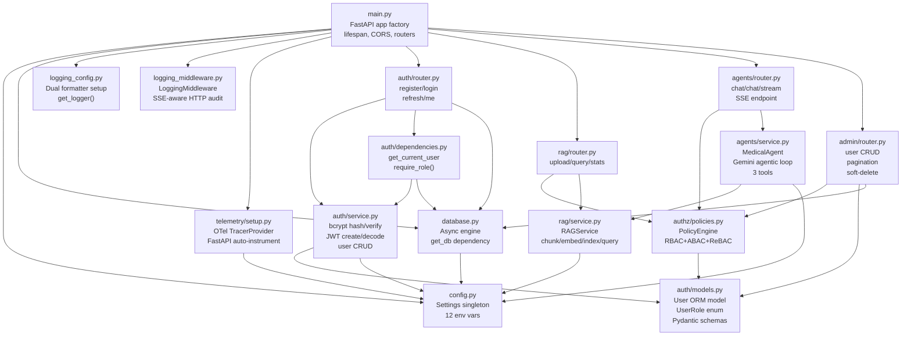

# Parts IX–X — Codebase Walkthrough & Senior Playbook

---

# Part IX — Codebase Walkthrough

## §45 File-by-File Tour with Dependency Graph

### Module Dependency Graph



---

### `main.py` — The Composition Root

**Role:** Wires every module together. The only place that knows about all routers.

```python
# main.py — key excerpt
from contextlib import asynccontextmanager
from fastapi import FastAPI
from fastapi.middleware.cors import CORSMiddleware
from auth.router import router as auth_router
from rag.router import router as rag_router
from agents.router import router as agents_router
from admin.router import router as admin_router
from database import init_db
from logging_config import setup_logging
from logging_middleware import LoggingMiddleware
from telemetry.setup import setup_telemetry
from config import settings

setup_logging()   # ← runs at import time, before FastAPI app is created

@asynccontextmanager
async def lifespan(app: FastAPI):
    await init_db()
    setup_telemetry()
    yield

app = FastAPI(title="MediAssist AI", lifespan=lifespan)
app.add_middleware(LoggingMiddleware)
app.add_middleware(CORSMiddleware,
    allow_origins=settings.cors_origins.split(","),
    allow_credentials=True, allow_methods=["*"], allow_headers=["*"],
)
app.include_router(auth_router)
app.include_router(rag_router)
app.include_router(agents_router)
app.include_router(admin_router)

@app.get("/health")
async def health():
    return {"status": "ok", "service": settings.service_name}
```

**Key observation:** `setup_logging()` runs at module import time (not in lifespan). This means logging is configured before the ASGI app starts accepting requests — important because Uvicorn itself logs during startup.

---

### `config.py` — The Settings Singleton

**Role:** Single source of truth for all environment-derived configuration.

All other modules import `settings` directly: `from config import settings`. This is a module-level singleton — created once at import, shared everywhere. Safe because Python's import system is single-threaded; subsequent imports return the cached module.

**Improvement opportunity:** Use `lru_cache` to make testability cleaner:

```python
from functools import lru_cache

@lru_cache
def get_settings() -> Settings:
    return Settings()

settings = get_settings()   # still usable as module-level singleton
# Tests can: get_settings.cache_clear() then monkeypatch
```

---

### `database.py` — The Data Access Foundation

**Role:** Provides the async SQLAlchemy engine, session factory, and the `get_db` FastAPI dependency.

Key design decisions:
- `expire_on_commit=False` — mandatory for async (see §27)
- `get_db` re-raises `HTTPException` without rolling back — intentional; HTTP errors don't indicate DB corruption
- `finally: await session.close()` — belt-and-suspenders; `async with` already handles this

---

### `auth/` — The Authentication Module

| File | Responsibility |
|------|---------------|
| `models.py` | ORM schema + Pydantic schemas (co-located for cohesion) |
| `service.py` | Pure business logic — no HTTP, no FastAPI |
| `dependencies.py` | FastAPI boundary — converts HTTP concerns (Bearer tokens) to domain objects (User) |
| `router.py` | HTTP endpoints — thin orchestrators calling service layer |

This is a clean separation: `service.py` is testable without FastAPI; `router.py` is thin.

---

### `authz/policies.py` — The Authorization Engine

**Role:** Centralizes all authorization logic in one `PolicyEngine` class.

Three paradigms unified:
- **RBAC** (`check_role`): "Does this user have role X?"
- **ABAC** (`check_owns_document`): "Does this user own this resource?"
- **ReBAC** (`check_nurse_patient_access`): "Is this nurse assigned to this patient?"

The `assert_*` variants raise `HTTPException(403)` — convenient but creates a coupling between domain logic and HTTP (see §48).

---

### `rag/` — The Document Intelligence Module

**Role:** Embeds and stores medical documents; retrieves relevant chunks for queries.

`RAGService` is a singleton (lazy-initialized via `get_rag_service()`). It holds:
- A ChromaDB `PersistentClient` — connects to the vector store
- A `collection` — the "table" in the vector store
- An `AsyncAnthropic` client — for Voyage embeddings

The singleton pattern avoids re-opening ChromaDB (which acquires a file lock) on every request.

---

### `agents/` — The Medical AI Module

**Role:** Runs an agentic Gemini loop that can search documents, calculate doses, and flag urgent situations.

`MedicalAgent` is **not** a singleton — it's created fresh per request via `_get_agent` dependency. Each request gets a new `chat = self.model.start_chat(history=...)` session. This is correct: Gemini chat sessions are stateless Python objects; the conversation state is passed in via `conversation_history`.

---

### `admin/` — User Management

**Role:** CRUD for User records. All endpoints gated behind `require_admin`.

Notable: soft-delete (`is_active = False`) preserves audit trail and referential integrity — you can still see which user uploaded a document even after "deletion."

---

### `telemetry/` — Observability

**Role:** Wires up OpenTelemetry tracing. Zero overhead when `otel_enabled=False`.

---

## §46 End-to-End Request Traces

### Trace 1 — Document Upload (`POST /api/v1/documents/upload`)

```
1. Client sends: POST /api/v1/documents/upload
   Headers: Authorization: Bearer <doctor_jwt>
   Body: multipart/form-data, file=protocol.txt

2. Uvicorn receives TCP packet, parses HTTP via httptools

3. LoggingMiddleware.dispatch() called
   → records start time (perf_counter)
   → reads request body bytes (saves to in-memory buffer)
   → re-injects body as Request._body (so FastAPI can re-read it)
   → calls call_next(request)  [passes to next layer]

4. CORSMiddleware checks Origin header, adds CORS response headers

5. FastAPI route matching: POST /api/v1/documents/upload → rag/router.py:upload_document

6. FastAPI resolves dependencies (in parallel where possible):
   a. get_db() → opens AsyncSessionLocal() → yields AsyncSession
   b. HTTPBearer() → extracts JWT from Authorization header
   c. get_current_user(credentials, db)
      → decode_token(jwt) → jose.jwt.decode() → payload: {"sub": "user-id", "type": "access"}
      → payload["type"] == "access" ✓
      → get_user_by_id(db, "user-id")
         → session.execute(select(User).where(User.id == "user-id"))
         → aiosqlite → SQLite → returns User row
      → user.is_active == True ✓
      → returns User object
   d. require_doctor(current_user)
      → policy_engine.assert_role(user, UserRole.DOCTOR)
      → user.role == "doctor" ✓ (or admin bypass)
      → returns User
   e. get_rag_service() → returns singleton RAGService

7. upload_document(file, current_user, rag) called:
   → content = await file.read()  [reads bytes from multipart buffer]
   → text = content.decode("utf-8")  [bytes → str]
   → text.strip() != ""  ✓
   → result = await rag.index_document(file.filename, text, current_user.id)
      → doc_id = uuid.uuid4()
      → chunks = _chunk_text(text)  [list of 500-char windows]
      → for each chunk:
           embedding = await _get_embedding(chunk)
             → AsyncAnthropic.embeddings.create(model="voyage-medical-2", input=chunk)
             → HTTP POST to Anthropic API  [awaited — event loop free during wait]
             → returns list[float] 384 dims
      → collection.add(ids, embeddings, documents, metadatas)
         → ChromaDB writes to ./chroma_db/ SQLite + HNSW index
      → returns {"doc_id": "...", "filename": "protocol.txt", "chunks_created": 7}
   → logger.info("Document uploaded", extra={"filename": ..., "user_id": ..., ...})
   → returns JSONResponse: {"doc_id": ..., "filename": ..., "chunks_created": 7, "message": "..."}

8. FastAPI serializes response (no response_model set here — raw dict returned)

9. LoggingMiddleware.dispatch() resumes:
   → response.headers content-type = "application/json" (not SSE)
   → reads response body
   → logs: status=200, duration=450ms, body={"doc_id": ...}

10. Uvicorn sends HTTP response to client
```

---

### Trace 2 — SSE Streaming Chat (`POST /api/v1/agent/chat/stream`)

```
1. Client sends: POST /api/v1/agent/chat/stream
   Headers: Authorization: Bearer <nurse_jwt>
   Body: {"message": "What is the standard dosage for amoxicillin in children?",
          "conversation_history": []}

2–5. Same as Trace 1 (Uvicorn → Middleware → FastAPI routing)

6. Dependency resolution:
   → get_current_user → User (nurse role)
   → require_medical_staff → asserts nurse is in [DOCTOR, NURSE] ✓
   → _get_agent(rag=get_rag_service()) → MedicalAgent(rag_service)
      → genai.configure(api_key=settings.gemini_api_key)
      → GenerativeModel("gemini-2.5-flash", tools=TOOL_DECLARATIONS)

7. chat_stream(data, current_user, agent) called:
   → history = []  (no prior conversation)
   → event_generator() async generator defined (not yet running)
   → StreamingResponse(event_generator(), media_type="text/event-stream") returned
      ← FastAPI begins sending response headers immediately
         Content-Type: text/event-stream
         Transfer-Encoding: chunked

8. event_generator() starts running as FastAPI streams the body:
   → async for chunk in agent.stream("What is dosage for amoxicillin...?", []):
      
      --- ITERATION 1 ---
      → chat = model.start_chat(history=[])
      → response = await chat.send_message_async("What is dosage for amoxicillin...?")
        [awaits Gemini API — event loop free; other requests can run]
      → Gemini returns: FunctionCall(name="rag_search", args={"query": "amoxicillin dosage children"})
      → function_calls = [FunctionCall("rag_search", {...})]
      → text_parts = []
      
      → _execute_tool("rag_search", {"query": "amoxicillin dosage children", "n_results": 5})
         → rag.query("amoxicillin dosage children", 5)
            → _get_embedding("amoxicillin dosage children")
              → Anthropic Voyage API call [awaited]
              → returns 384-dim embedding
            → collection.query(embedding, n_results=5)
              → ChromaDB HNSW search → top-5 chunks
              → returns [{"content": "Amoxicillin 25-45mg/kg/day...", "relevance_score": 0.92, ...}, ...]
         → formats results: "[Result 1] Source: pediatric_protocols.txt (relevance: 0.92)\nAmoxicillin..."
         → returns formatted string
      
      → packages FunctionResponse part
      → current_message = [FunctionResponse part]
      
      --- ITERATION 2 ---
      → response = await chat.send_message_async([FunctionResponse])
        [Gemini receives tool result, generates final answer]
      → Gemini returns: text_parts = ["Based on the pediatric protocols, amoxicillin dosage for children..."]
      → function_calls = []  (no more tool calls)
      
      → for word in "Based on the pediatric protocols...".split(" "):
           yield "Based " → event_generator yields "data: Based \n\n"
           yield "on "    → event_generator yields "data: on \n\n"
           ... (word by word)
   
   → async for chunk in agent.stream() exhausted
   → event_generator yields "data: [DONE]\n\n"

9. LoggingMiddleware.dispatch() resumes with response:
   → content_type = "text/event-stream"
   → logs: status=200, duration=1250ms, body="[streaming — SSE]"
   ← DOES NOT consume the stream body

10. Uvicorn sends chunked HTTP response to client
    Each "data: word\n\n" is sent as an HTTP chunk immediately
```

---

# Part X — Senior Playbook

## §47 Design Patterns in This Codebase

### 1. Repository Pattern (partial)

`auth/service.py` functions (`get_user_by_email`, `get_user_by_id`, `create_user`) form an implicit repository for `User`. They abstract database access behind a function interface.

It's not a full Repository (no interface/abstract class), but the intent is there. A formal version:

```python
# Formal Repository pattern
from abc import ABC, abstractmethod

class UserRepository(ABC):
    @abstractmethod
    async def find_by_email(self, email: str) -> User | None: ...
    @abstractmethod
    async def find_by_id(self, user_id: str) -> User | None: ...
    @abstractmethod
    async def save(self, user: User) -> User: ...

class SQLUserRepository(UserRepository):
    def __init__(self, session: AsyncSession):
        self.session = session

    async def find_by_email(self, email: str) -> User | None:
        result = await self.session.execute(
            select(User).where(User.email == email)
        )
        return result.scalar_one_or_none()
```

### 2. Dependency Injection (full)

FastAPI's `Depends()` implements DI comprehensively. The entire app is wired through the DI graph — no service locator antipattern, no global mutable state (except the singleton `settings` and `_rag_service`).

### 3. Strategy Pattern — LLM Providers

The codebase has two LLM providers (Anthropic for embeddings, Gemini for generation) but no formal Strategy abstraction. A production system should extract:

```python
from abc import ABC, abstractmethod

class EmbeddingProvider(ABC):
    @abstractmethod
    async def embed(self, text: str) -> list[float]: ...

class AnthropicEmbeddingProvider(EmbeddingProvider):
    async def embed(self, text: str) -> list[float]:
        response = await self.client.embeddings.create(
            model="voyage-medical-2", input=text
        )
        return response.embeddings[0].embedding

class MockEmbeddingProvider(EmbeddingProvider):
    async def embed(self, text: str) -> list[float]:
        seed = hash(text) % (2**31)
        return [random.Random(seed).uniform(-1, 1) for _ in range(384)]
```

`RAGService` would take `EmbeddingProvider` in its constructor — injectable, testable, swappable.

### 4. Policy Engine Pattern (unified RBAC/ABAC/ReBAC)

`authz/policies.py:PolicyEngine` unifies three authorization models under one interface. This is a custom pattern — not a classic Gang of Four pattern — but an excellent design for systems with complex authorization needs.

### 5. Async Generator as Streaming Pipeline

`agents/service.py:MedicalAgent.stream` → `agents/router.py:event_generator` → `StreamingResponse` forms a streaming pipeline where each layer is an async generator. Data flows lazily from Gemini through Python to the HTTP client without buffering the full response.

---

## §48 Honest Refactor Critique

These are real issues in the current code, ordered by impact.

### 1. `PolicyEngine` Raises `HTTPException` (High Impact)

**Problem:** `authz/policies.py` is a domain-layer class that imports and raises `fastapi.HTTPException`. The domain layer now depends on the HTTP framework.

```python
# Current — domain layer knows about HTTP
@staticmethod
def assert_role(user: User, *roles: UserRole) -> None:
    if not PolicyEngine.check_role(user, *roles):
        raise HTTPException(status_code=403, detail="Insufficient permissions")
```

**Fix:** Raise a domain exception; translate at the FastAPI boundary.

```python
# Domain exception — no FastAPI import
class InsufficientPermissionsError(Exception):
    def __init__(self, message: str = "Insufficient permissions"):
        self.message = message

# Policy engine raises domain exception
@staticmethod
def assert_role(user: User, *roles: UserRole) -> None:
    if not PolicyEngine.check_role(user, *roles):
        raise InsufficientPermissionsError()

# FastAPI boundary translates it
# main.py
@app.exception_handler(InsufficientPermissionsError)
async def permission_error_handler(request, exc):
    return JSONResponse(status_code=403, content={"detail": exc.message})
```

### 2. `MedicalAgent` Created Per Request (Medium Impact)

**Problem:** `agents/router.py:_get_agent` creates a new `MedicalAgent` per request, which calls `genai.configure(api_key=...)` on every request.

```python
# agents/router.py — current
def _get_agent(rag: RAGService = Depends(get_rag_service)) -> MedicalAgent:
    return MedicalAgent(rag)   # new instance every request
```

`genai.configure()` sets a module-level global — redundant repetition. The model object itself is lightweight, but it's unnecessary instantiation.

**Fix:** Cache `MedicalAgent` as a singleton alongside `RAGService`.

```python
_agent: MedicalAgent | None = None

def get_agent(rag: RAGService = Depends(get_rag_service)) -> MedicalAgent:
    global _agent
    if _agent is None:
        _agent = MedicalAgent(rag)
    return _agent
```

### 3. `bcrypt` Blocking in Async Context (Medium Impact)

**Problem:** `auth/service.py:hash_password` calls `bcrypt.hashpw` synchronously inside async endpoints. At rounds=12, this takes ~100ms and blocks the event loop.

```python
# Current — blocks event loop
async def register(data: UserRegister, db: AsyncSession = Depends(get_db)):
    user = await create_user(db, data)   # calls hash_password inside
```

**Fix:** Run bcrypt in a threadpool executor.

```python
import asyncio
import functools

async def hash_password_async(password: str) -> str:
    loop = asyncio.get_running_loop()
    return await loop.run_in_executor(
        None,
        functools.partial(
            lambda p: bcrypt.hashpw(p.encode(), bcrypt.gensalt()).decode(),
            password,
        ),
    )
```

### 4. `_chunk_text` Returns List Instead of Generator (Low Impact)

**Problem:** `rag/service.py:_chunk_text` builds and returns a full `list[str]`. For a 100-page PDF, this materializes all chunks in memory at once.

**Fix:** Change to a generator.

```python
def _chunk_text(self, text: str) -> Generator[str, None, None]:
    start = 0
    while start < len(text):
        # ... same logic ...
        yield chunk.strip()
        start += len(chunk) - self.CHUNK_OVERLAP
```

Callers would need to iterate rather than index, but embedding and inserting can happen lazily.

### 5. Missing `asyncio.timeout` on External API Calls (High Impact)

**Problem:** `agents/service.py` has no timeout on Gemini calls. `rag/service.py` has no timeout on Anthropic calls. A slow/stuck API holds the connection indefinitely.

**Fix:**

```python
# agents/service.py
import asyncio

async def stream(self, message: str, history: list[dict]) -> AsyncGenerator[str, None]:
    try:
        async with asyncio.timeout(60.0):   # 60s total budget for agentic loop
            # ... existing loop logic ...
    except asyncio.TimeoutError:
        yield "I'm taking too long to respond. Please try again."
```

### 6. `cors_origins` Parsing Is Fragile (Low Impact)

`settings.cors_origins.split(",")` doesn't strip whitespace. `"http://a.com, http://b.com"` produces `["http://a.com", " http://b.com"]` — the space breaks CORS matching.

**Fix:** `[o.strip() for o in settings.cors_origins.split(",")]` or switch to `list[str]` in Settings.

### 7. No Catch-All Exception Handler (Medium Impact)

Unhandled exceptions return a generic `{"detail": "Internal Server Error"}` with no logging. Add to `main.py`:

```python
@app.exception_handler(Exception)
async def unhandled_exception_handler(request: Request, exc: Exception):
    logger.error("Unhandled exception", exc_info=exc)
    return JSONResponse(status_code=500, content={"detail": "Internal server error"})
```

---

## §49 Senior Code Review Checklist

Use this when reviewing PRs on this codebase.

### Async Correctness
- [ ] No `time.sleep()`, `requests.get()`, or other blocking calls inside `async def`
- [ ] All external I/O uses `await` (DB queries, HTTP calls, file reads)
- [ ] `asyncio.timeout()` or `asyncio.wait_for()` wraps all external API calls
- [ ] `CancelledError` is re-raised after cleanup, not swallowed

### SQLAlchemy / Database
- [ ] Uses 2.0 style: `select()`, `Mapped[]`, no `session.query()`
- [ ] Session obtained via `Depends(get_db)`, not created manually
- [ ] No lazy-loaded relationships accessed after session close
- [ ] Explicit `await session.commit()` only when mutation happened
- [ ] Bulk operations use `execute()` with `INSERT`/`UPDATE` statements, not N individual `session.add()` calls

### Pydantic
- [ ] `@field_validator` not `@validator` (v2 vs v1)
- [ ] `model_dump(exclude_unset=True)` for PATCH payloads (not `exclude_none`)
- [ ] `ConfigDict(from_attributes=True)` on ORM-facing response models
- [ ] `response_model` set on all endpoints returning sensitive data (filters `hashed_password`, etc.)

### Authentication & Security
- [ ] `algorithms=["HS256"]` is a list (not a string) in `decode_token`
- [ ] Token type checked: `payload.get("type") == "access"`
- [ ] `SECRET_KEY` is not the development default in production
- [ ] No raw SQL string interpolation (`f"... WHERE email = '{email}'"`)
- [ ] CORS origins are explicit, never `"*"` with credentials

### FastAPI Structure
- [ ] Endpoints are thin (call service layer, don't contain business logic)
- [ ] `response_model` set or `model_dump()` called explicitly — no raw ORM objects returned
- [ ] `status_code` set correctly (201 for create, 204 for delete, etc.)
- [ ] Background work that can fail uses proper task queues, not `BackgroundTasks`

### Error Handling
- [ ] Specific exception types caught, not bare `except Exception` at non-boundaries
- [ ] `raise ... from exc` used when re-raising with context
- [ ] Domain exceptions don't import FastAPI (`HTTPException`)
- [ ] A catch-all `@app.exception_handler(Exception)` exists with logging

### Testing
- [ ] New endpoints have tests covering: success, 401/403, 422 (validation error), edge cases
- [ ] External API calls (Anthropic, Gemini) are mocked via `pytest-httpx`
- [ ] Tests use `db_engine` fixture (in-memory SQLite), not the production DB
- [ ] `app.dependency_overrides.clear()` called after test (fixture teardown handles this)
