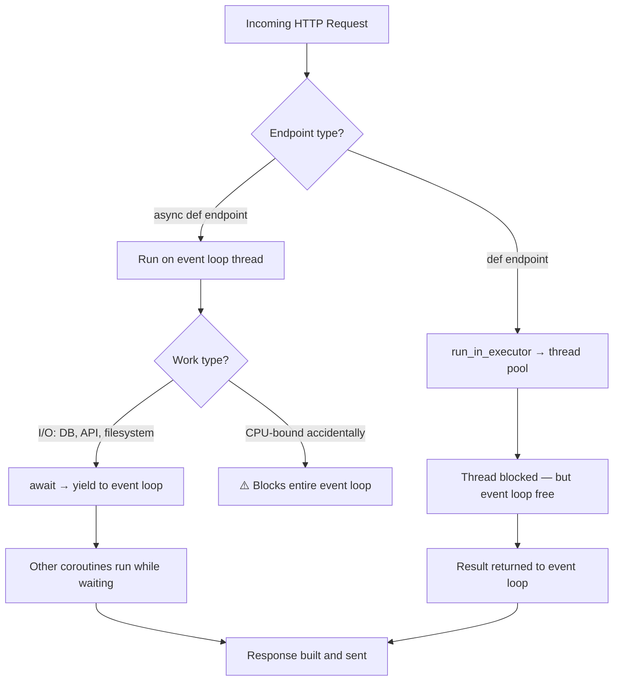

# Parts VI–VIII — Observability, Testing, Production

---

# Part VI — Observability

## §36 OpenTelemetry

### What It Is

OpenTelemetry (OTel) is the CNCF standard for distributed observability — traces, metrics, and logs with a vendor-neutral API. You emit spans; an exporter ships them to your backend (Jaeger, Tempo, Honeycomb, Datadog).

### Core Concepts

```
Trace  — the end-to-end journey of one request across all services
  └── Span  — a single unit of work within that trace
        ├── name: "POST /api/v1/agent/chat/stream"
        ├── start_time / end_time
        ├── attributes: {"http.method": "POST", "user.id": "abc"}
        └── events / errors attached
```

> **🔁 Dart Analogy:** Like Firebase Performance Monitoring traces, but standardized, vendor-neutral, and with full distributed context propagation across service boundaries.

### Your `telemetry/setup.py` — Annotated

```python
# telemetry/setup.py
from opentelemetry import trace
from opentelemetry.sdk.trace import TracerProvider
from opentelemetry.sdk.trace.export import BatchSpanProcessor, ConsoleSpanExporter
from opentelemetry.sdk.resources import Resource
from opentelemetry.exporter.otlp.proto.grpc.trace_exporter import OTLPSpanExporter

def setup_telemetry() -> None:
    if not settings.otel_enabled:   # default: False — zero overhead in dev
        return

    # Resource identifies this service in trace backends
    resource = Resource.create({"service.name": settings.service_name})
    provider = TracerProvider(resource=resource)

    # Exporter: gRPC to collector (production) or stdout (debugging)
    if settings.otel_endpoint:
        exporter = OTLPSpanExporter(endpoint=settings.otel_endpoint)
    else:
        exporter = ConsoleSpanExporter()   # prints spans to stdout

    # BatchSpanProcessor: buffers spans and sends in batches
    # (vs SimpleSpanProcessor: sends every span synchronously — don't use in prod)
    provider.add_span_processor(BatchSpanProcessor(exporter))
    trace.set_tracer_provider(provider)

    # Auto-instrument FastAPI: creates spans for every HTTP request automatically
    try:
        from opentelemetry.instrumentation.fastapi import FastAPIInstrumentor
        FastAPIInstrumentor().instrument()
    except ImportError:
        pass
```

### Auto-Instrumentation vs Manual Spans

`FastAPIInstrumentor().instrument()` monkey-patches FastAPI to auto-create spans for every route. This gives you:
- `HTTP method + path` as span name
- `http.status_code`, `http.url`, `net.peer.ip` as attributes
- Automatic error recording on 5xx responses

For deeper traces (e.g., span for each Gemini tool call), add manual spans:

```python
# Example: manual span for Gemini call
from opentelemetry import trace

tracer = trace.get_tracer(__name__)

async def _execute_tool(self, tool_name: str, tool_input: dict) -> str:
    with tracer.start_as_current_span(f"tool.{tool_name}") as span:
        span.set_attribute("tool.name", tool_name)
        span.set_attribute("tool.input", str(tool_input))
        result = await self._run_tool(tool_name, tool_input)
        span.set_attribute("tool.result_length", len(result))
        return result
```

### OTLP gRPC Exporter

The exporter ships spans over gRPC to an OpenTelemetry Collector or directly to a backend:

```bash
# Run a local Jaeger all-in-one for development:
docker run -d --name jaeger \
  -p 4317:4317 \    # OTLP gRPC
  -p 16686:16686 \  # Jaeger UI
  jaegertracing/all-in-one:latest

# .env
OTEL_ENABLED=true
OTEL_ENDPOINT=http://localhost:4317
```

> **💡 Senior Tip:** `BatchSpanProcessor` buffers spans and sends asynchronously — it has a queue. If your app crashes before the queue flushes, you lose those spans. Call `trace.get_tracer_provider().shutdown()` in your lifespan teardown to flush the queue on graceful shutdown.

---

## §37 Structured Logging

### Your Dual-Formatter Architecture

`logging_config.py` sets up two output streams:

```
logging_config.py
├── Console handler  → _PrettyFormatter  (human-readable, ANSI colors, INFO+)
└── File handler     → _JsonFormatter    (machine-parseable JSON, DEBUG+, logs/app.log)
```

### `_PrettyFormatter` — Console Output

```python
# logging_config.py
class _PrettyFormatter(logging.Formatter):
    _COLORS = {
        "DEBUG": "\033[36m",    # cyan
        "INFO": "\033[32m",     # green
        "WARNING": "\033[33m",  # yellow
        "ERROR": "\033[31m",    # red
        "CRITICAL": "\033[35m", # magenta
    }
    _RESET = "\033[0m"

    def format(self, record: logging.LogRecord) -> str:
        color = self._COLORS.get(record.levelname, "")
        timestamp = datetime.fromtimestamp(record.created).strftime("%Y-%m-%d %H:%M:%S")
        return (
            f"{timestamp} | {color}{record.levelname:<8}{self._RESET} | "
            f"{record.name} | {record.getMessage()}"
        )
```

### `_JsonFormatter` — Structured File Output

```python
# logging_config.py
class _JsonFormatter(logging.Formatter):
    _STANDARD_FIELDS = {
        "name", "msg", "args", "levelname", "levelno", "pathname",
        "filename", "module", "exc_info", "exc_text", "stack_info",
        "lineno", "funcName", "created", "msecs", "relativeCreated",
        "thread", "threadName", "processName", "process", "message",
        "taskName",
    }

    def format(self, record: logging.LogRecord) -> str:
        log_entry = {
            "timestamp": datetime.utcfromtimestamp(record.created).isoformat() + "Z",
            "level": record.levelname,
            "logger": record.name,
            "message": record.getMessage(),
        }
        # Include any extra fields passed via logger.info("msg", extra={...})
        for key, value in record.__dict__.items():
            if key not in self._STANDARD_FIELDS:
                log_entry[key] = value
        if record.exc_info:
            log_entry["exception"] = self.formatException(record.exc_info)
        return json.dumps(log_entry)
```

The `extra={...}` pattern is how you add structured fields to log lines:

```python
# logging_middleware.py usage
logger.info(
    "HTTP request",
    extra={
        "event": "http_request",
        "method": request.method,
        "path": request.url.path,
        "status_code": response.status_code,
        "duration_ms": round(duration * 1000, 2),
    }
)
# JSON output: {"timestamp": "...", "level": "INFO", "event": "http_request",
#               "method": "POST", "path": "/api/v1/agent/chat/stream", ...}
```

### Silencing Noisy Libraries

```python
# logging_config.py — silence chatty third-party loggers
for noisy in ["uvicorn.access", "chromadb", "httpx", "sqlalchemy.engine",
              "sqlalchemy.pool", "aiosqlite", "passlib"]:
    logging.getLogger(noisy).setLevel(logging.WARNING)
```

Without this, SQLAlchemy logs every SQL query, httpx logs every HTTP request, and Chroma logs HNSW index operations — overwhelming your app logs.

> **💡 Senior Tip:** In production, ship `logs/app.log` (JSON) to a log aggregator (Loki, CloudWatch, Datadog). Write log queries against the JSON fields: `{event="http_request"} | status_code >= 400` in LogQL. The pretty console output is for humans in dev; the JSON file is for machines in prod.

### Correlating Logs with Traces

Add trace/span IDs to log entries for correlation in observability platforms:

```python
# In logging_config.py _JsonFormatter.format():
from opentelemetry import trace

span = trace.get_current_span()
if span.is_recording():
    ctx = span.get_span_context()
    log_entry["trace_id"] = format(ctx.trace_id, "032x")
    log_entry["span_id"] = format(ctx.span_id, "016x")
```

Now every log line carries the trace ID — click a log in Grafana Loki and jump directly to the matching trace in Tempo.

---

# Part VII — Testing

## §38 Pytest Foundations

### Fixtures — Not `setUp`/`tearDown`

> **🔁 Dart Analogy:** pytest fixtures are like Flutter's `setUp`/`tearDown` but composable and dependency-injected. You declare what your test needs, pytest builds the dependency graph and calls fixtures in the right order.

```python
# conftest.py — fixture definition
import pytest_asyncio

@pytest_asyncio.fixture
async def db_engine():
    engine = create_async_engine("sqlite+aiosqlite:///:memory:")
    async with engine.begin() as conn:
        await conn.run_sync(Base.metadata.create_all)
    yield engine                                         # test runs here
    async with engine.begin() as conn:
        await conn.run_sync(Base.metadata.drop_all)
    await engine.dispose()

@pytest_asyncio.fixture
async def client(db_engine):   # db_engine injected automatically
    ...
    yield async_client
```

### `pytest-asyncio` — Critical Configuration

`pytest-asyncio` 0.21+ requires explicit `asyncio_mode` configuration. Without it, async tests silently skip or fail:

```ini
# pytest.ini (present in this codebase)
[pytest]
asyncio_mode = auto
```

`asyncio_mode = auto` makes ALL async test functions and fixtures automatically async-aware — no `@pytest.mark.asyncio` decorator needed on every test.

> **⚠️ Gotcha:** `asyncio_mode = auto` changed behavior in 0.21. Before 0.21, the default was `auto`. After 0.21, the default became `strict` (requiring explicit marks). Your `pytest.ini` pins `asyncio_mode = auto` to maintain pre-0.21 behavior — this is the right call.

### Fixtures Scope

```python
@pytest.fixture(scope="session")   # created once for entire test session
@pytest.fixture(scope="module")    # created once per test module
@pytest.fixture(scope="class")     # created once per test class
@pytest.fixture(scope="function")  # default: created for each test function
```

`conftest.py` uses function scope for `db_engine` and `client` — each test gets a clean in-memory database. Slower but guarantees test isolation.

### `conftest.py` — Special File

pytest automatically discovers `conftest.py` files at directory boundaries. Fixtures defined in `conftest.py` are available to all tests in that directory and subdirectories — no import needed.

```
tests/
├── conftest.py          ← fixtures available to all tests/
├── test_auth.py         ← uses client, db_engine from conftest.py
└── test_rag.py          ← uses client, db_engine from conftest.py
```

---

## §39 Testing FastAPI

### `AsyncClient` + `ASGITransport`

```python
# tests/conftest.py
from httpx import AsyncClient, ASGITransport
from main import app

@pytest_asyncio.fixture
async def client(db_engine):
    test_session = async_sessionmaker(db_engine, expire_on_commit=False)

    async def override_get_db():
        async with test_session() as session:
            try:
                yield session
            finally:
                await session.close()

    # Override the real database with in-memory test database
    app.dependency_overrides[get_db] = override_get_db

    async with AsyncClient(
        transport=ASGITransport(app=app),   # routes requests directly to ASGI app
        base_url="http://test",             # any base URL; not actually called
    ) as c:
        yield c

    app.dependency_overrides.clear()   # clean up overrides after test
```

`ASGITransport` bypasses the network entirely — requests go directly to the FastAPI ASGI app in-process. This is faster and more reliable than a real test server.

### Dependency Override Pattern

`app.dependency_overrides` is a dict mapping the real dependency callable to a replacement:

```python
# Replace ANY dependency for testing:
app.dependency_overrides[get_rag_service] = lambda: MockRAGService()
app.dependency_overrides[get_current_user] = lambda: mock_user
```

This is the correct way to test individual layers in isolation. Never use monkeypatching on FastAPI internals.

### `pytest-httpx` — Mocking External HTTP Calls

`pytest-httpx==0.32.0` intercepts `httpx.AsyncClient` requests and returns mock responses — essential for testing Anthropic/Gemini calls without hitting real APIs:

```python
# tests/test_rag.py — example (not in current codebase but the pattern to know)
from pytest_httpx import HTTPXMock

async def test_embedding_call(httpx_mock: HTTPXMock, client: AsyncClient):
    # Mock the Anthropic embeddings API
    httpx_mock.add_response(
        url="https://api.anthropic.com/v1/embeddings",
        json={
            "embeddings": [{"embedding": [0.1] * 384}],
            "model": "voyage-medical-2",
        },
    )

    response = await client.post(
        "/api/v1/documents/upload",
        files={"file": ("test.txt", b"Patient shows signs of MI", "text/plain")},
        headers={"Authorization": "Bearer <doctor_token>"},
    )
    assert response.status_code == 200
```

> **⚠️ Gotcha:** `pytest-httpx` version must align with `httpx` version. `pytest-httpx==0.32.0` requires `httpx==0.27.x`. A version mismatch produces cryptic errors. Pin them together.

### Test Auth Helper Pattern

`test_auth.py` uses a helper to register and log in:

```python
# tests/test_auth.py
async def register_and_login(client: AsyncClient, data: dict) -> str:
    await client.post("/api/v1/auth/register", json=data)
    resp = await client.post(
        "/api/v1/auth/login",
        json={"email": data["email"], "password": data["password"]},
    )
    return resp.json()["access_token"]

# Usage in tests:
async def test_doctor_can_upload(client: AsyncClient):
    token = await register_and_login(client, DOCTOR_DATA)
    response = await client.post(
        "/api/v1/documents/upload",
        files={"file": ("doc.txt", b"Clinical protocol...", "text/plain")},
        headers={"Authorization": f"Bearer {token}"},
    )
    assert response.status_code == 200
```

---

## §40 Test DB Strategy

### In-Memory SQLite Per Test

```python
# tests/conftest.py
TEST_DB_URL = "sqlite+aiosqlite:///:memory:"

@pytest_asyncio.fixture
async def db_engine():
    engine = create_async_engine(TEST_DB_URL)
    async with engine.begin() as conn:
        await conn.run_sync(Base.metadata.create_all)   # create schema
    yield engine
    async with engine.begin() as conn:
        await conn.run_sync(Base.metadata.drop_all)      # drop schema
    await engine.dispose()                               # close connections
```

`:memory:` creates a SQLite database entirely in RAM. It's:
- **Fast** — no disk I/O
- **Isolated** — each engine instance is a separate database
- **Fresh** — `create_all` + `drop_all` gives a clean slate per test

### Environment Setup Before Import

```python
# tests/conftest.py — MUST be at the very top, before any app imports
import os
os.environ.setdefault("SECRET_KEY", "test-secret-key-minimum-32-characters!!")
os.environ.setdefault("ANTHROPIC_API_KEY", "sk-ant-test")
os.environ.setdefault("DATABASE_URL", "sqlite+aiosqlite:///:memory:")
os.environ.setdefault("CHROMA_PERSIST_DIRECTORY", "/tmp/test_chroma")
os.environ.setdefault("OTEL_ENABLED", "false")
```

This must happen before `from config import settings` is executed. Python caches module imports — if `config.py` is imported anywhere before these env vars are set, `Settings()` will read the real values (or fail on missing required vars). `os.environ.setdefault` only sets if not already set, so CI environment variables still take precedence.

> **💡 Senior Tip:** `ANTHROPIC_API_KEY = "sk-ant-test"` triggers the pseudo-random embedding fallback in `rag/service.py`:

```python
# rag/service.py
if not self.anthropic or settings.anthropic_api_key.startswith("sk-ant-test"):
    # deterministic pseudo-random embedding — no real API call
```

This is a clever test-mode gate that avoids actual API calls and costs in tests while still exercising the indexing/retrieval code paths.

---

# Part VIII — Production Concerns

## §41 Uvicorn in Production

### Single Worker — Development

```bash
uvicorn backend.main:app --reload --port 8000
# --reload: restarts on file changes (dev only; high CPU in prod)
```

### Multi-Worker — Production via Gunicorn

Uvicorn alone is single-process. For production, use Gunicorn as a process manager with Uvicorn workers:

```bash
gunicorn backend.main:app \
  --workers 4 \
  --worker-class uvicorn.workers.UvicornWorker \
  --bind 0.0.0.0:8000 \
  --timeout 120 \
  --graceful-timeout 30 \
  --keep-alive 5
```

Each Uvicorn worker is a separate process with its own event loop. 4 workers = 4 CPUs utilized. The GIL doesn't apply across processes.

**Worker count formula:**
```
workers = (2 × CPU_cores) + 1   # Gunicorn recommendation
# For 2-core server: 5 workers
# For 4-core server: 9 workers
```

> **⚠️ Gotcha — ChromaDB Multi-Worker Incompatibility:** As noted in §33, `PersistentClient` uses a file lock. With 4 Gunicorn workers, all 4 processes try to open the same Chroma directory → only one succeeds, the rest crash on startup. Fix: use a single worker OR switch to `chromadb.HttpClient` pointing at a standalone Chroma server.

### Uvicorn Performance Flags

```bash
uvicorn backend.main:app \
  --loop uvloop \         # use uvloop event loop (2-4x faster than asyncio)
  --http httptools \      # use httptools HTTP parser (2x faster than h11)
  --workers 4             # multi-process (or use Gunicorn instead)
```

`uvicorn[standard]` installs `uvloop` and `httptools` as optional extras. They're automatically used when available — you don't need to specify the flags explicitly if using `uvicorn[standard]`.

---

## §42 Concurrency Model Recap



**The three layers:**

| Layer | Mechanism | Use case |
|-------|-----------|----------|
| Async coroutines | `asyncio` event loop | I/O-bound: DB queries, HTTP calls, file reads |
| Threadpool | `run_in_executor` / `def` endpoints | Sync libraries, CPU-light blocking work (bcrypt) |
| Process pool | `ProcessPoolExecutor` | True CPU-bound: ML inference, image processing |

In MediAssist, all endpoints are `async def` except none — even `hash_password` is called from async context. This works at low load; under high concurrent load, consider moving bcrypt to a `def` endpoint or wrapping in `run_in_executor`.

---

## §43 Security Checklist

### CORS Configuration

```python
# main.py — current implementation
app.add_middleware(
    CORSMiddleware,
    allow_origins=settings.cors_origins.split(","),   # ["http://localhost:3000"]
    allow_credentials=True,
    allow_methods=["*"],
    allow_headers=["*"],
)
```

> **⚠️ Gotcha:** `allow_origins=["*"]` with `allow_credentials=True` is invalid — browsers reject this combination. The current code avoids this by reading origins from settings. Never hardcode `"*"` in production with credentials.

Production CORS:
```python
CORSMiddleware(
    allow_origins=["https://app.mediassist.com"],
    allow_credentials=True,
    allow_methods=["GET", "POST", "PATCH", "DELETE"],
    allow_headers=["Authorization", "Content-Type"],
)
```

### JWT Security

| Risk | Current State | Fix |
|------|--------------|-----|
| Weak secret | Default `dev-secret-key-change-in-production-32ch` | Generate 256-bit random key: `openssl rand -hex 32` |
| Short-lived tokens | 60 min access, 7 day refresh | Fine; reduce refresh to 1 day for medical data |
| No token revocation | JWTs are valid until expiry | Add a Redis revocation set for logout |
| `"none"` algorithm | Protected: `algorithms=["HS256"]` list | ✅ Already correct |
| Token type check | `payload.get("type") != "access"` | ✅ Already correct |

### Input Validation

FastAPI + Pydantic automatically validate all request bodies. SQL injection is prevented by SQLAlchemy parameterized queries — the ORM never interpolates user input into raw SQL strings.

> **⚠️ Gotcha:** `session.execute(text("SELECT * FROM users WHERE email = :email"), {"email": email})` is safe. `session.execute(text(f"SELECT * FROM users WHERE email = '{email}'"))` is a SQL injection vulnerability. Never use f-strings in raw SQL.

### Secrets Management

```bash
# Development: .env file (gitignored)
SECRET_KEY=change-me-in-production

# Production: environment variables injected by platform
# Docker: --env-file or -e flags
# Kubernetes: Secrets mounted as env vars
# AWS: Secrets Manager + SSM Parameter Store
# Never: hardcode secrets in code or check them into git
```

---

## §44 Performance Gotchas

### N+1 Query Problem

The classic ORM trap — not currently an issue in MediAssist (no relationships loaded), but critical to know:

```python
# N+1 — WRONG: 1 query for users + N queries for each user's documents
users = (await session.execute(select(User))).scalars().all()
for user in users:
    docs = user.documents   # lazy load = 1 SQL per user = N+1 total queries

# Correct: 1 query with JOIN
stmt = select(User).options(selectinload(User.documents))
users = (await session.execute(stmt)).scalars().all()
# user.documents is already loaded — no additional queries
```

> **🔁 Dart Analogy:** Exactly like the N+1 problem in Drift (moor) or Isar when you iterate relationships without eager loading.

### Blocking Calls in Async Endpoints

Already covered in §11, but the production consequence: one blocking call in an `async def` endpoint holds the event loop for its entire duration. Under 100 concurrent requests with 100ms bcrypt hashes, your effective throughput drops to 10 req/sec from the event loop thread.

Detection: use `asyncio.get_event_loop().set_debug(True)` in development — it logs coroutines that take >100ms and didn't yield.

### Pydantic Serialization Overhead

`response_model=UserResponse` serializes every response. For endpoints returning large lists, this compounds:

```python
# admin/router.py — list_users returns up to 100 UserResponse objects
# Each UserResponse.model_validate(user) runs validation logic
# For 100 users with 8 fields each = 800 field validations per request

# Optimization: use response_model_include to only validate needed fields
@router.get("/users", response_model_include={"id", "email", "role"})
```

Or switch to `model_dump()` explicitly with `include=` for bulk responses.

### Connection Pool Sizing

With SQLite + aiosqlite, the pool is effectively a single connection. When you move to PostgreSQL:

```python
engine = create_async_engine(
    postgres_url,
    pool_size=10,        # persistent connections kept open
    max_overflow=20,     # extra connections allowed under load
    pool_timeout=30,     # seconds to wait for a connection before error
    pool_recycle=3600,   # recycle connections after 1 hour (avoid stale connections)
)
```

Pool size = expected concurrent DB operations. With 4 Gunicorn workers × 10 pool size = 40 max connections. PostgreSQL's default max is 100 — size accordingly.
