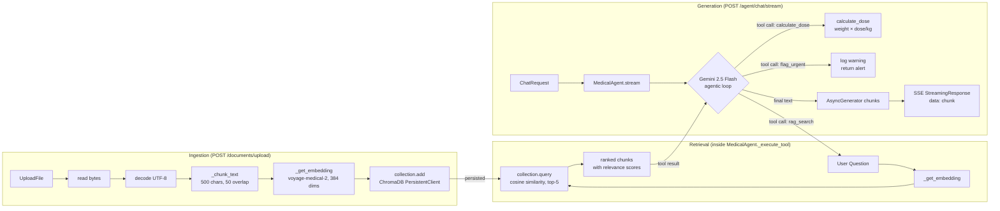

# Part V — The AI Layer

## §31 Anthropic SDK

### What It Is

The official Python SDK for Anthropic's Claude API and Voyage embedding models. `rag/service.py` uses `AsyncAnthropic` for embeddings; the codebase does not yet use Claude for generation (that's Gemini), but the pattern for doing so is covered here for completeness.

### `AsyncAnthropic` Initialization

```python
# rag/service.py
from anthropic import AsyncAnthropic

self.anthropic = AsyncAnthropic(api_key=settings.anthropic_api_key) if api_key else None
```

`AsyncAnthropic` is the async client — all methods return coroutines. The sync counterpart `Anthropic` blocks the event loop; never use it in FastAPI endpoints.

### Voyage Embeddings — How `rag/service.py` Uses It

```python
# rag/service.py
async def _get_embedding(self, text: str) -> list[float]:
    if not self.anthropic or settings.anthropic_api_key.startswith("sk-ant-test"):
        # Test mode: pseudo-random deterministic embedding
        seed = hash(text) % (2**31)
        rng = random.Random(seed)
        return [rng.uniform(-1, 1) for _ in range(self.EMBEDDING_DIMENSIONS)]  # 384 dims

    response = await self.anthropic.embeddings.create(
        model="voyage-medical-2",      # domain-specific medical embedding model
        input=text,
    )
    return response.embeddings[0].embedding   # list[float], 384 dimensions
```

**Why `voyage-medical-2`?** Voyage models are Anthropic's embedding models, trained for high-quality semantic similarity. `voyage-medical-2` is fine-tuned on biomedical literature — critically important for a clinical decision support system where "MI" should be closer to "myocardial infarction" than to "Michigan".

### Rate Limits and Retries

Anthropic's SDK has built-in automatic retries with exponential backoff for rate limit errors (HTTP 429) and transient server errors (HTTP 5xx):

```python
# Configure retry behavior
client = AsyncAnthropic(
    api_key=settings.anthropic_api_key,
    max_retries=3,       # default is 2
    timeout=60.0,        # seconds; default is 600s
)
```

> **⚠️ Gotcha:** The default timeout is **600 seconds** (10 minutes). For a web API, this means a stalled Anthropic request would hold your endpoint open for 10 minutes. Always set an explicit, sane timeout:

```python
client = AsyncAnthropic(api_key=..., timeout=30.0)
```

### Claude Generation (Pattern for Future Use)

```python
from anthropic import AsyncAnthropic

client = AsyncAnthropic(api_key=settings.anthropic_api_key)

# Non-streaming
response = await client.messages.create(
    model="claude-opus-4-7",   # or "claude-sonnet-4-6", "claude-haiku-4-5-20251001"
    max_tokens=1024,
    system="You are a clinical assistant. Only answer from provided context.",
    messages=[
        {"role": "user", "content": "What is the dosage for amoxicillin?"}
    ],
)
text = response.content[0].text
tokens_used = response.usage.input_tokens + response.usage.output_tokens

# Streaming
async with client.messages.stream(
    model="claude-opus-4-7",
    max_tokens=1024,
    messages=[{"role": "user", "content": "..."}],
) as stream:
    async for text_chunk in stream.text_stream:
        yield text_chunk   # yield each chunk in an async generator
```

> **💡 Senior Tip:** `response.usage` gives you exact token counts. Log these per request to track costs. At Claude Sonnet pricing (~$3/M input tokens), a RAG response that sends 5K tokens of context 1000 times/day = ~$4.50/day in input costs alone — know your numbers before production.

---

## §32 Google Generative AI SDK

### What It Is

The official Python SDK for Google's Gemini family of models. `agents/service.py` uses `google-generativeai` (`genai`) for the core agentic medical assistant — function calling, multi-turn conversation, and tool use.

### Model Initialization

```python
# agents/service.py
import google.generativeai as genai
from google.ai.generativelanguage_v1beta import protos

genai.configure(api_key=settings.gemini_api_key)

self.model = genai.GenerativeModel(
    model_name="gemini-2.5-flash",   # GEMINI_MODEL constant
    tools=TOOL_DECLARATIONS,         # list of FunctionDeclaration
    system_instruction=SYSTEM_PROMPT,
)
```

`GenerativeModel` is stateless — it holds configuration, not conversation state. Chat state is held in a `ChatSession` object created per conversation.

### Tool Declarations (Function Calling)

Gemini's function calling uses `protos.FunctionDeclaration` to declare tools the model can invoke:

```python
# agents/service.py
TOOL_DECLARATIONS = [
    protos.FunctionDeclaration(
        name="rag_search",
        description="Search indexed medical documents for relevant protocols and guidelines.",
        parameters=protos.Schema(
            type=protos.Type.OBJECT,
            properties={
                "query": protos.Schema(
                    type=protos.Type.STRING,
                    description="The medical question or keyword to search for",
                ),
                "n_results": protos.Schema(
                    type=protos.Type.INTEGER,
                    description="Number of results to return (default: 5)",
                ),
            },
            required=["query"],
        ),
    ),
    protos.FunctionDeclaration(
        name="calculate_dose",
        description="Calculate medication dosage based on patient weight.",
        parameters=protos.Schema(
            type=protos.Type.OBJECT,
            properties={
                "medication": protos.Schema(type=protos.Type.STRING),
                "weight_kg": protos.Schema(type=protos.Type.NUMBER),
                "dose_mg_per_kg": protos.Schema(type=protos.Type.NUMBER),
                "age_years": protos.Schema(type=protos.Type.NUMBER),
            },
            required=["medication", "weight_kg", "dose_mg_per_kg"],
        ),
    ),
    protos.FunctionDeclaration(
        name="flag_urgent",
        description="Flag a clinical situation as urgent.",
        parameters=protos.Schema(
            type=protos.Type.OBJECT,
            properties={
                "reason": protos.Schema(type=protos.Type.STRING),
                "severity": protos.Schema(
                    type=protos.Type.STRING,
                    enum=["high", "critical"],
                ),
            },
            required=["reason", "severity"],
        ),
    ),
]
```

> **🔁 Dart Analogy:** `FunctionDeclaration` is the JSON Schema–style tool manifest, equivalent to what you'd define in an OpenAI tool spec. Gemini reads this, decides when to call a tool, and returns a structured `FunctionCall` part in its response for you to execute.

### The Agentic Loop

`MedicalAgent.stream` implements a **ReAct-style** (Reason + Act) agentic loop capped at `MAX_ITERATIONS = 10`:

```python
# agents/service.py — agentic loop (simplified)
async def stream(self, message: str, conversation_history: list[dict]):
    chat = self.model.start_chat(history=self._build_history(conversation_history))
    current_message = message
    iterations = 0

    while iterations < self.MAX_ITERATIONS:
        iterations += 1
        response = await chat.send_message_async(current_message)

        # Separate response parts into tool calls and text
        function_calls = [p.function_call for p in response.parts if hasattr(p, "function_call") and p.function_call.name]
        text_parts = [p.text for p in response.parts if hasattr(p, "text") and p.text]

        if function_calls:
            # Execute all tools, package results as FunctionResponse parts
            tool_results = []
            for fc in function_calls:
                result = await self._execute_tool(fc.name, dict(fc.args))
                tool_results.append(
                    protos.Part(
                        function_response=protos.FunctionResponse(
                            name=fc.name,
                            response={"result": result},
                        )
                    )
                )
            current_message = tool_results   # next iteration sends tool results
        else:
            # No more tool calls — stream the final text response
            for part_text in text_parts:
                for word in part_text.split(" "):
                    yield word + " "
            break
```

> **⚠️ Gotcha — Gemini uses `"model"` not `"assistant"`:** OpenAI and Anthropic use `role: "assistant"` for model turns. Gemini uses `role: "model"`. `_build_history` handles this:

```python
# agents/service.py
def _build_history(self, conversation_history: list[dict]) -> list[dict]:
    history = []
    for msg in conversation_history:
        role = "model" if msg["role"] == "assistant" else msg["role"]
        history.append({"role": role, "parts": [msg["content"]]})
    return history
```

If you're building a multi-provider system that talks to both Anthropic and Gemini, normalize to `"assistant"` in your domain layer and convert at the adapter boundary.

### Rate Limiting — `ResourceExhausted`

Gemini's free tier has strict RPM (requests per minute) limits. `agents/service.py` handles this:

```python
# agents/service.py
try:
    response = await chat.send_message_async(current_message)
except Exception as e:
    if "ResourceExhausted" in str(type(e).__name__) or "429" in str(e):
        raise HTTPException(status_code=429, detail="AI service rate limit exceeded")
    raise HTTPException(status_code=500, detail=f"AI service error: {str(e)}")
```

> **💡 Senior Tip:** Catching on string matching (`"ResourceExhausted" in str(type(e).__name__)`) is fragile. The correct import:

```python
from google.api_core.exceptions import ResourceExhausted

except ResourceExhausted:
    raise HTTPException(status_code=429, detail="AI rate limit exceeded. Try again shortly.")
```

---

## §33 ChromaDB

### What a Vector Database Is

A vector database stores embeddings (high-dimensional float arrays) and supports similarity search: "given this query vector, return the N stored vectors most similar to it." This is the retrieval engine for RAG.

> **🔁 Dart Analogy:** Think of it like a NoSQL database where the "primary key" is semantic meaning, not a string ID. Instead of `WHERE id = '123'`, you ask "give me the 5 documents most semantically similar to this question."

### HNSW — The Index Algorithm

ChromaDB uses **Hierarchical Navigable Small World (HNSW)** graphs for approximate nearest-neighbor search. You don't need to understand the algorithm deeply, but know:

- **Approximate** — it trades a tiny accuracy loss for massive speed gains over exact search
- **Scales well** — O(log n) search time as collection size grows
- **Memory-resident** — the index lives in RAM; persistent client saves/loads from disk

### `RAGService` — ChromaDB Usage

```python
# rag/service.py
import chromadb

class RAGService:
    COLLECTION_NAME = "medical_documents"

    def __init__(self):
        # PersistentClient saves index to disk at chroma_persist_directory
        self.client = chromadb.PersistentClient(
            path=settings.chroma_persist_directory   # "./chroma_db"
        )
        self.collection = self.client.get_or_create_collection(
            name=self.COLLECTION_NAME,
            metadata={"hnsw:space": "cosine"},   # distance metric
        )
```

### Distance Metrics — Cosine vs L2

| Metric | Formula | Best for |
|--------|---------|----------|
| `cosine` | `1 - (A·B / (\|A\|\|B\|))` | Text embeddings (direction matters, not magnitude) |
| `l2` | Euclidean distance | Spatial data, normalized vectors |
| `ip` | Inner product (dot product) | When vectors are unit-normalized |

The codebase correctly uses `cosine` — text embeddings encode semantic meaning in vector direction, not magnitude.

> **⚠️ Gotcha — Chroma returns distances, not similarities:** `collection.query()` returns `distances`, not similarity scores. For cosine distance, a distance of `0.0` = identical, `2.0` = opposite. `rag/service.py` converts this:

```python
# rag/service.py
async def query(self, question: str, n_results: int = 5) -> list[dict]:
    embedding = await self._get_embedding(question)
    results = self.collection.query(
        query_embeddings=[embedding],
        n_results=n_results,
        include=["documents", "metadatas", "distances"],
    )
    chunks = []
    for i, doc in enumerate(results["documents"][0]):
        chunks.append({
            "content": doc,
            "relevance_score": 1 - results["distances"][0][i],  # cosine: 1 - distance
            "metadata": results["metadatas"][0][i],
        })
    return chunks
```

### Document Indexing Flow

```python
# rag/service.py
async def index_document(self, filename: str, content: str, uploader_id: str) -> dict:
    doc_id = str(uuid.uuid4())
    chunks = self._chunk_text(content)   # list of str

    embeddings = []
    for chunk in chunks:
        emb = await self._get_embedding(chunk)
        embeddings.append(emb)

    self.collection.add(
        ids=[f"{doc_id}_chunk_{i}" for i in range(len(chunks))],
        embeddings=embeddings,
        documents=chunks,
        metadatas=[
            {
                "filename": filename,
                "doc_id": doc_id,
                "chunk_index": i,
                "uploader_id": uploader_id,
            }
            for i in range(len(chunks))
        ],
    )
    return {"doc_id": doc_id, "filename": filename, "chunks_created": len(chunks)}
```

**Metadata filtering** — ChromaDB supports filter queries on metadata:

```python
# Example: search only documents uploaded by a specific doctor
results = collection.query(
    query_embeddings=[embedding],
    n_results=5,
    where={"uploader_id": {"$eq": doctor_id}},   # metadata filter
)
```

This isn't used in the current codebase but is available.

### `PersistentClient` vs `EphemeralClient`

| | `PersistentClient(path=...)` | `EphemeralClient()` |
|--|------------------------------|---------------------|
| Storage | SQLite + HNSW files on disk | In-memory only |
| Survives restart | Yes | No |
| Used in | Production (`./chroma_db/`) | Testing (`/tmp/test_chroma`) |
| Thread-safe | Yes (single process) | Yes |
| Multi-process | No (file lock) | N/A |

> **⚠️ Gotcha:** `PersistentClient` uses a file lock. If two server workers try to open the same Chroma directory simultaneously, one will fail. This means you **cannot run multiple Uvicorn worker processes** with the current Chroma setup. Either use a single worker, or move to a remote Chroma server (`chromadb.HttpClient`) for multi-worker deployments.

> **💡 Senior Tip:** ChromaDB is excellent for prototyping and single-server deployments. For production at scale, consider `pgvector` (PostgreSQL extension) if you're already on Postgres — it eliminates a separate service and gets you transactional consistency between document records and their embeddings.

---

## §34 RAG Pipeline End-to-End

### Architecture



### Chunking Strategy — `_chunk_text`

```python
# rag/service.py
def _chunk_text(self, text: str) -> list[str]:
    CHUNK_SIZE = 500
    CHUNK_OVERLAP = 50
    MIN_CHUNK_LENGTH = 20

    chunks = []
    start = 0
    while start < len(text):
        end = start + CHUNK_SIZE
        chunk = text[start:end]

        # Try to split at a sentence boundary within the last 100 chars
        if end < len(text):
            for sep in [". ", "! ", "? "]:
                boundary = chunk.rfind(sep, CHUNK_SIZE - 100)
                if boundary != -1:
                    chunk = chunk[:boundary + 1]
                    break

        if len(chunk.strip()) >= MIN_CHUNK_LENGTH:
            chunks.append(chunk.strip())
        start += len(chunk) - CHUNK_OVERLAP

    return chunks
```

**Why overlap?** A sentence that straddles a chunk boundary would be split — half its context in chunk N, half in chunk N+1. With 50-character overlap, both chunks contain the boundary sentence, ensuring retrieval captures it regardless of which chunk is returned.

**Why sentence-boundary splitting?** Embedding models perform best when chunks contain complete thoughts. Cutting mid-sentence degrades semantic quality.

### The Retrieval → Generation Bridge

When Gemini decides to call `rag_search`, it sends a `FunctionCall` part. `_execute_tool` routes this to `RAGService.query`:

```python
# agents/service.py
async def _execute_tool(self, tool_name: str, tool_input: dict) -> str:
    if tool_name == "rag_search":
        query = tool_input.get("query", "")
        n_results = tool_input.get("n_results", 5)
        results = await self.rag.query(query, n_results)

        if not results:
            return "No relevant documents found in the medical knowledge base."

        formatted = []
        for i, chunk in enumerate(results, 1):
            score = chunk.get("relevance_score", 0)
            metadata = chunk.get("metadata", {})
            source = metadata.get("filename", "Unknown source")
            formatted.append(
                f"[Result {i}] Source: {source} (relevance: {score:.2f})\n{chunk['content']}"
            )
        return "\n\n".join(formatted)
```

The tool result is then sent back to Gemini as a `FunctionResponse`. Gemini incorporates the retrieved context into its next response, grounding its answer in your uploaded documents rather than parametric (training) knowledge.

### Why RAG Over Fine-Tuning?

| | RAG | Fine-tuning |
|--|-----|------------|
| Update knowledge | Add documents to Chroma | Retrain the model |
| Domain accuracy | High (grounded in your docs) | High |
| Cost | Low (embedding + query) | High (GPU training) |
| Freshness | Real-time | Static until next fine-tune |
| Hallucination risk | Lower (model cites sources) | Higher (bakes in patterns) |
| Best for | Dynamic, updateable knowledge bases | Changing model behavior/style |

For a clinical protocol system where guidelines change quarterly, RAG is the right choice.

---

## §35 pypdf

### What It Is

`pypdf` (formerly `PyPDF2`) is a pure-Python PDF parser. It extracts text, metadata, and page content from PDF files without requiring system dependencies like Ghostscript.

### Current Usage in the Codebase

`pypdf` is in `requirements.txt` but **not currently used** in any `.py` file — the upload endpoint only handles text files (`content.decode("utf-8")`). It's a planned dependency for PDF ingestion.

### How to Add PDF Support to `rag/router.py`

```python
# rag/router.py — add PDF support
from pypdf import PdfReader
import io

@router.post("/upload")
async def upload_document(
    file: UploadFile = File(...),
    current_user: User = Depends(require_doctor),
    rag: RAGService = Depends(get_rag_service),
):
    content = await file.read()
    filename = file.filename or "unknown"

    # Detect PDF by content type or extension
    if file.content_type == "application/pdf" or filename.lower().endswith(".pdf"):
        text = extract_pdf_text(content)
    else:
        try:
            text = content.decode("utf-8")
        except UnicodeDecodeError:
            raise HTTPException(status_code=400, detail="File must be UTF-8 text or PDF")

    if not text.strip():
        raise HTTPException(status_code=400, detail="File contains no extractable text")

    result = await rag.index_document(filename, text, current_user.id)
    return result


def extract_pdf_text(content: bytes) -> str:
    reader = PdfReader(io.BytesIO(content))
    pages = []
    for page in reader.pages:
        page_text = page.extract_text()
        if page_text:
            pages.append(page_text)
    return "\n\n".join(pages)
```

### pypdf Extraction Quirks

> **⚠️ Gotcha:** pypdf extracts text in PDF reading order, which is NOT always visual order. Multi-column PDFs, tables, and footnotes often produce garbled output. Common issues:

1. **Column merging:** A two-column paper may be extracted as alternating lines from both columns
2. **Table cells:** Tables become space-separated text with no row/column structure
3. **Scanned PDFs:** pypdf returns empty strings for image-based PDFs (needs OCR — `pytesseract`)
4. **Headers/footers mixed in:** Page numbers and headers appear inline with body text

**Mitigation strategies:**

```python
# 1. Filter short/garbage lines
def extract_pdf_text(content: bytes) -> str:
    reader = PdfReader(io.BytesIO(content))
    pages = []
    for page in reader.pages:
        text = page.extract_text(extraction_mode="layout")  # pypdf 4.x layout mode
        if text:
            # Filter lines shorter than 20 chars (likely headers/footers)
            lines = [l for l in text.split("\n") if len(l.strip()) > 20]
            pages.append("\n".join(lines))
    return "\n\n".join(pages)

# 2. Check if text was actually extracted
def is_scanned_pdf(reader: PdfReader) -> bool:
    text = "".join(
        page.extract_text() or "" for page in reader.pages[:3]
    )
    return len(text.strip()) < 100   # likely scanned if almost no text
```

> **💡 Senior Tip:** For production medical document ingestion, replace pypdf with `pdfplumber` (better table and layout handling) or `pymupdf` (binds to MuPDF, handles complex layouts, scanned PDFs with built-in OCR). Both have pip packages and richer APIs. pypdf is the lightweight option when you control the documents; switch when you don't.
