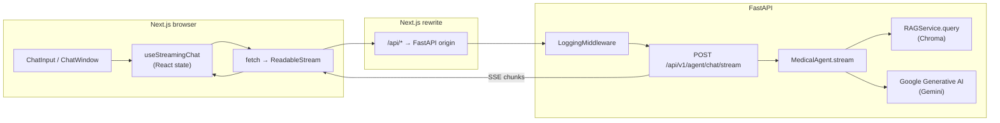

# MediAssist chat flow — end-to-end technical walkthrough

Audience: senior mobile engineers unfamiliar with Python / basic React.

This document walks through the complete path of a user message from the UI through the backend to the AI response and back.

---

## PLAN

### Scope & assumptions

**In scope (primary path — streaming chat)**

- **UI:** `frontend/src/components/chat/ChatInput.tsx`, `ChatWindow.tsx`, `MessageBubble.tsx`, `StreamingMessage.tsx`, `ToolCallIndicator.tsx`, `SourceCitations.tsx`
- **State & transport:** `frontend/src/hooks/useStreamingChat.ts`, `frontend/src/lib/auth.ts`, `frontend/next.config.js` (API rewrite)
- **Page shell:** `frontend/src/app/(dashboard)/chat/page.tsx`, `frontend/src/components/layout/AuthGuard.tsx`
- **Backend:** `backend/main.py`, `backend/logging_middleware.py`, `backend/agents/router.py`, `backend/agents/service.py`
- **Auth & policy:** `backend/auth/dependencies.py`, `backend/authz/policies.py` (what the agent router imports)
- **RAG:** `backend/rag/service.py` (`query`, `get_rag_service`)

**Skipped (not on the critical path for “type message → AI reply”)**

- Login/register API details — tokens exist before chat; covered only as Bearer in header
- `frontend/src/lib/api.ts` — chat uses raw `fetch`, not this helper
- Telemetry, admin routers, tests — not invoked per message
- Document upload/indexing — feeds RAG indirectly; only `rag_search` execution is relevant here

**Assumption:** User is already authenticated (JWT in `localStorage`) so chat requests include `Authorization`.

### Architecture map



### Walkthrough outline

1. **Chat page composition** — Dashboard route renders `ChatWindow`; auth gate ensures login.
2. **Input & submit** — Controlled textarea, Enter-to-send, `ChatInput` calls `onSend(text)`.
3. **Hook: optimistic UI + history** — Append user + empty assistant rows; build `conversation_history` from prior messages.
4. **HTTP + proxy** — Same-origin `/api/...` rewritten to uvicorn; JSON body + Bearer token.
5. **Stream read loop** — Parse SSE-like `data: ...` lines; append text; handle `[DONE]` / `[ERROR]`, tool markers.
6. **FastAPI entry** — Router mounts under `/api/v1/agent`; `StreamingResponse` wraps async generator.
7. **Auth & RBAC** — JWT → DB user; only doctor/nurse (or admin) reach the handler.
8. **Dependency injection** — `MedicalAgent` constructed with shared `RAGService` singleton.
9. **Agent loop** — Gemini chat with tools; tool rounds yield markers; final text “streamed” word-by-word.
10. **RAG tool** — `rag_search` embeds query, Chroma similarity search, formatted context back to model.
11. **Rendering** — Re-renders on each chunk; `StreamingMessage` shows cursor; scroll-to-bottom effect.
12. **Errors & stop** — AbortController, hook/finally cleanup; middleware logs streams without full body.
13. **Persistence** — No DB writes for chat messages in this flow (in-memory UI + history in JSON only).

---

## EXPLANATION

### Stage 1 — Route and chat shell

**What happens**  
The chat screen is a thin page that mounts `ChatWindow`. The dashboard layout wraps children with auth; unauthenticated users are redirected to login.

**Where it lives**  
`frontend/src/app/(dashboard)/chat/page.tsx`, `frontend/src/components/layout/AuthGuard.tsx`

**How it works**

```tsx
// frontend/src/app/(dashboard)/chat/page.tsx
import { ChatWindow } from '@/components/chat/ChatWindow'

export default function ChatPage() {
  return (
    <div className="h-full">
      <ChatWindow />
    </div>
  )
}
```

```tsx
// frontend/src/components/layout/AuthGuard.tsx (excerpt)
export function AuthGuard({ children }: { children: ReactNode }) {
  const { isAuthenticated, isLoading, initialize } = useAuthStore()
  const router = useRouter()
  // ...
  useEffect(() => {
    if (!isLoading && !isAuthenticated) {
      router.push('/login')
    }
  }, [isLoading, isAuthenticated, router])
```

**Mobile analogy**  
Like a SwiftUI `View` whose body only embeds your chat coordinator, with a session gate similar to “if not logged in, replace root with login flow.”

**Python/React notes**

- Next.js **App Router**: `page.tsx` default export is the route component.
- **`'use client'`** on `AuthGuard` means it runs in the browser (hooks, `useRouter`).
- **Zustand** (`useAuthStore`) is global client state—lighter than Redux, comparable to a small ObservableObject / singleton store.

---

### Stage 2 — User types and submits

**What happens**  
Local state holds textarea value. Submit clears the field and calls `onSend(text)`. Enter sends; Shift+Enter newline; max 2000 characters.

**Where it lives**  
`frontend/src/components/chat/ChatInput.tsx`

**How it works**

```tsx
function handleSubmit(e?: FormEvent) {
  e?.preventDefault()
  const text = value.trim()
  if (!text || disabled || isStreaming) return
  setValue('')
  // ...
  onSend(text)
}

function handleKeyDown(e: KeyboardEvent<HTMLTextAreaElement>) {
  if (e.key === 'Enter' && !e.shiftKey) {
    e.preventDefault()
    handleSubmit()
  }
}
```

**Mobile analogy**  
`UITextView` delegate + “Send” that validates and calls a callback—same separation as passing a closure into a custom input view.

**Python/React notes**

- **Controlled component**: `value` + `onChange` tie the DOM to React state (like binding a text field two-way in SwiftUI).
- **`FormEvent` / `KeyboardEvent`** are React’s synthetic events (wrapped; pooling behavior differs from raw DOM).

---

### Stage 3 — Chat window wires hook and scroll

**What happens**  
`ChatWindow` owns `useStreamingChat()`, passes `sendMessage` to suggestions and `ChatInput`, maps `messages` to bubbles, scrolls to bottom when `messages` change.

**Where it lives**  
`frontend/src/components/chat/ChatWindow.tsx`

**How it works**

```tsx
export function ChatWindow() {
  const { messages, isStreaming, error, sendMessage, stopStreaming, clearConversation } = useStreamingChat()
  const bottomRef = useRef<HTMLDivElement>(null)

  useEffect(() => {
    bottomRef.current?.scrollIntoView({ behavior: 'smooth' })
  }, [messages])
```

**Mobile analogy**  
Coordinator / ViewModel owns message list + actions; the view observes and scrolls—similar to `scrollToBottom()` after `UITableView` reload.

**Python/React notes**

- **`useEffect(..., [messages])`** runs after paint when dependency changes—like onAppear / onChange combined.
- **`useRef`** holds a mutable DOM anchor without triggering re-renders when the ref object changes.

---

### Stage 4 — Client state: messages, optimistic assistant row, history payload

**What happens**  
On send: append user message and an assistant message with empty `content` and `isStreaming: true` (optimistic placeholder). Request body is `{ message, conversation_history }` where history is previous messages only (`messages` state at invoke time).

**Where it lives**  
`frontend/src/hooks/useStreamingChat.ts`

**How it works**

```tsx
const userMsg: ChatMessage = { id: makeId(), role: 'user', content: text }
const assistantId = makeId()
const assistantMsg: ChatMessage = {
  id: assistantId,
  role: 'assistant',
  content: '',
  isStreaming: true,
  toolCalls: [],
}

setMessages((prev) => [...prev, userMsg, assistantMsg])
setIsStreaming(true)

const history = messages.map((m) => ({ role: m.role, content: m.content }))
const requestBody = { message: text, conversation_history: history }
```

**Mobile analogy**  
Append two cells immediately (user bubble + “typing” bubble), then fire network—like optimistic UI on send, except the assistant row fills incrementally.

**Python/React notes**

- **`setMessages((prev) => ...)`** functional update avoids stale state when batching updates.
- **`useCallback(..., [isStreaming, messages])`** ties `sendMessage` to `messages`; history is the snapshot when the callback last closed over `messages` (typical React pattern; fine while sends are serialized via `isStreaming`).

---

### Stage 5 — Request, proxy, auth header

**What happens**  
`fetch` POST to `/api/v1/agent/chat/stream` with JSON and optional `Authorization: Bearer <access>`. Token comes from `localStorage`, not cookies.

**Where it lives**  
`frontend/src/hooks/useStreamingChat.ts`, `frontend/src/lib/auth.ts`, `frontend/next.config.js`

**How it works**

```tsx
const token = getAccessToken()
const url = '/api/v1/agent/chat/stream'
const res = await fetch(url, {
  method: 'POST',
  headers: {
    'Content-Type': 'application/json',
    ...(token ? { Authorization: `Bearer ${token}` } : {}),
  },
  body: JSON.stringify(requestBody),
  signal: controller.signal,
})
```

```js
// frontend/next.config.js
async rewrites() {
  return [
    {
      source: '/api/:path*',
      destination: `${process.env.NEXT_PUBLIC_API_URL || 'http://localhost:8000'}/api/:path*`,
    },
  ]
},
```

**Mobile analogy**  
URLSession to a relative path where the app’s dev server reverse-proxies to the API—similar to an iOS app hitting `https://app.example.com/api` that nginx forwards to a backend. Bearer token matches `Authorization` header on every request.

**Python/React notes**

- Next **`rewrites`** avoid CORS for same-origin `/api` during development.
- **`AbortController`** is the web standard for cancel—like `URLSessionTask.cancel()`.

---

### Stage 6 — Reading the stream (SSE-style framing)

**What happens**  
Response body is read as bytes; buffer split on `\n\n`; lines starting with `data: ` are payloads. `[DONE]` ends streaming state; `[ERROR]` shows error; lines starting with `[Using tool:` update `toolCalls`; else chunk appends to assistant `content`.

**Where it lives**  
`frontend/src/hooks/useStreamingChat.ts`

**How it works**

```tsx
const reader = res.body!.getReader()
const decoder = new TextDecoder()
let buffer = ''

while (true) {
  const { done, value } = await reader.read()
  if (done) break

  buffer += decoder.decode(value, { stream: true })
  const lines = buffer.split('\n\n')
  buffer = lines.pop() ?? ''

  for (const line of lines) {
    if (!line.startsWith('data: ')) continue
    const data = line.slice(6)
    // [DONE], [ERROR], [Using tool:, or append chunk
  }
}
```

**Mobile analogy**  
Incremental URLSession body stream + manual framing—like parsing SSE or chunked HTTP where you buffer until event boundaries.

**Python/React notes**

- **`ReadableStream` + `getReader()`** is browser Streams API; **`TextDecoder` with `{ stream: true }`** handles UTF-8 cut mid-codepoint.
- This is **SSE-shaped** (`data: ...\n\n`) though the client uses `fetch`, not `EventSource` (which is GET-only).

---

### Stage 7 — Backend entry: FastAPI + streaming response

**What happens**  
`POST /api/v1/agent/chat/stream` validates JSON into `ChatRequest`, resolves user and agent, returns SSE media type with an async generator yielding `data: <chunk>\n\n`, then `data: [DONE]\n\n`.

**Where it lives**  
`backend/main.py` (app + middleware), `backend/agents/router.py`

**How it works**

```python
# backend/main.py (router registration)
app.include_router(auth_router)
app.include_router(rag_router)
app.include_router(agents_router)
app.include_router(admin_router)
```

```python
# backend/agents/router.py
@router.post("/chat/stream")
async def chat_stream(
    data: ChatRequest,
    current_user: User = Depends(require_medical_staff),
    agent: MedicalAgent = Depends(_get_agent),
):
    history = [{"role": m.role, "content": m.content} for m in data.conversation_history]

    async def event_generator() -> AsyncGenerator[str, None]:
        try:
            async for chunk in agent.stream(data.message, history):
                yield f"data: {chunk}\n\n"
            yield "data: [DONE]\n\n"
        except Exception as exc:
            yield f"data: [ERROR] {str(exc)}\n\n"

    return StreamingResponse(
        event_generator(),
        media_type="text/event-stream",
        headers={"Cache-Control": "no-cache", "X-Accel-Buffering": "no"},
    )
```

**Mobile analogy**  
REST endpoint returning a long-lived HTTP response—conceptually like chunked transfer with labeled lines, not a separate WebSocket.

**Python/React notes**

- **FastAPI** (`APIRouter`) + **`Depends`** = declarative middleware chain / DI (similar to interceptor + injected services).
- **`StreamingResponse`** accepts an **async generator**; Starlette pulls it ASGI-style.
- **`BaseModel`** (Pydantic v2) validates body → Python types automatically.

---

### Stage 8 — JWT auth and RBAC

**What happens**  
`HTTPBearer` extracts JWT; claims decoded; user loaded from DB; inactive users rejected. `require_medical_staff` allows doctor, nurse, or admin.

**Where it lives**  
`backend/auth/dependencies.py`, `backend/authz/policies.py`

**Note:** `agents/router.py` imports **`require_medical_staff` from `authz.policies`**, not from `dependencies.py` (both modules define similarly named helpers).

**How it works**

```python
# backend/auth/dependencies.py (excerpt)
async def get_current_user(
    credentials: HTTPAuthorizationCredentials = Depends(bearer_scheme),
    db: AsyncSession = Depends(get_db),
) -> User:
    token = credentials.credentials
    payload = decode_token(token)
    if payload.get("type") != "access":
        raise HTTPException(...)
```

```python
# backend/authz/policies.py
def require_medical_staff(current_user: User = Depends(get_current_user)) -> User:
    policy_engine.assert_role(current_user, UserRole.DOCTOR, UserRole.NURSE)
    return current_user
```

**Mobile analogy**  
Alamofire interceptor attaching JWT + role check before handler runs—same as middleware + guard.

**Python/React notes**

- **`Depends(get_current_user)`** nests: `require_medical_staff` depends on user resolution.
- **`async def` + `AsyncSession`** matches async/await DB (SQLAlchemy 2 async), unlike classic sync Django.

---

### Stage 9 — Agent construction and tool/RAG wiring

**What happens**  
`_get_agent` builds `MedicalAgent` with `RAGService` from `get_rag_service()` (process-wide singleton). Gemini model is configured with tool declarations and a system instruction.

**Where it lives**  
`backend/agents/router.py`, `backend/agents/service.py`, `backend/rag/service.py`

**How it works**

```python
def _get_agent(rag: RAGService = Depends(get_rag_service)) -> MedicalAgent:
    return MedicalAgent(rag)
```

```python
class MedicalAgent:
    def __init__(self, rag_service: RAGService) -> None:
        self.rag = rag_service
        genai.configure(api_key=settings.gemini_api_key)
        self.model = genai.GenerativeModel(
            model_name=GEMINI_MODEL,
            tools=TOOL_DECLARATIONS,
            system_instruction=SYSTEM_PROMPT,
        )
```

**Mobile analogy**  
Service locator / factory hands the same search client (RAG) to each use case instance per request—like injecting a document repository into a chat interactor.

**Python/React notes**

- **`Depends(get_rag_service)`** without `()` passes the callable to FastAPI; framework calls it per request but inside `get_rag_service` a **global singleton** is used.
- **`google.generativeai`** configures API key module-wide via `genai.configure`.

---

### Stage 10 — Agent stream: Gemini, tool loop, “word streaming”

**What happens**  
Conversation history is converted to Gemini’s **`model`** role (not `assistant`). Each iteration: `send_message_async`. If the model returns function calls, each is executed (`rag_search`, etc.), markers are yielded to the client, then function responses are sent back as the next turn input. When there are no tool calls, the implementation concatenates text, then **yields each word + space**—so streaming is **simulated after the full model reply**, not token-true streaming from Gemini.

**Where it lives**  
`backend/agents/service.py`

**How it works**

```python
async def stream(
    self,
    message: str,
    conversation_history: list[dict[str, str]],
) -> AsyncGenerator[str, None]:
    chat = self.model.start_chat(history=self._build_history(conversation_history))
    current_input: Any = message
    iterations = 0

    while iterations < self.MAX_ITERATIONS:
        iterations += 1
        response = await chat.send_message_async(current_input)
        # ...
        if not function_calls:
            full_text = "".join(text_parts)
            for word in full_text.split(" "):
                yield word + " "
            break

        for fc in function_calls:
            yield f"[Using tool: {tool_name}...]\n"
            result = await self._execute_tool(tool_name, tool_input)
            # build function_response parts...
        current_input = fn_response_parts
```

**Mobile analogy**  
LLM session + function calling loop (like OpenAI tools): model proposes tools, host executes, feeds results—repeat until natural language answer. The final “stream” here is **your server chunking finished text**, like emitting typed animation after the answer is fully known.

**Python/React notes**

- **`AsyncGenerator[str, None]`** is an async iterable; `async for` in the router consumes it.
- **`HTTPException`** inside async generators propagates to Starlette as errors (often caught in `event_generator` and turned into `[ERROR]` payloads).

---

### Stage 11 — RAG tool execution

**What happens**  
`rag_search` calls `RAGService.query`: embed question (Anthropic voyage when configured; otherwise deterministic pseudo-vectors), Chroma similarity search, format chunks with filenames and scores for the model.

**Where it lives**  
`backend/agents/service.py` (`_execute_tool`), `backend/rag/service.py` (`query`)

**How it works**

```python
if tool_name == "rag_search":
    chunks = await self.rag.query(tool_input["query"], tool_input.get("n_results", 5))
    for i, chunk in enumerate(chunks, 1):
        parts.append(
            f"[Source {i}: {chunk['metadata'].get('filename', 'unknown')} "
            f"(relevance: {chunk['relevance_score']:.0%})]\n{chunk['content']}"
        )
```

```python
async def query(self, question: str, n_results: int = 5) -> list[dict[str, Any]]:
    embedding = await self._get_embedding(question)
    results = self.collection.query(
        query_embeddings=[embedding],
        n_results=min(n_results, self.collection.count() or 1),
        include=["documents", "metadatas", "distances"],
    )
```

**Mobile analogy**  
On-device vector search / remote embedding + vector DB pipeline—same pattern as Spotlight-style retrieval, but server-side.

---

### Stage 12 — UI rendering of assistant output

**What happens**  
Each chunk updates React state → re-render. Assistant messages use `StreamingMessage` for text + pulsing cursor when `isStreaming`. Tool rounds show `ToolCallIndicator` while streaming.

**Where it lives**  
`frontend/src/components/chat/MessageBubble.tsx`, `frontend/src/components/chat/StreamingMessage.tsx`

**How it works**

```tsx
{isUser ? (
  <p className="text-sm whitespace-pre-wrap break-words">{message.content}</p>
) : (
  <>
    {message.toolCalls && message.toolCalls.length > 0 && message.isStreaming && (
      <ToolCallIndicator toolCalls={message.toolCalls} />
    )}
    <StreamingMessage content={message.content} isStreaming={!!message.isStreaming} />
  </>
)}
```

**Mobile analogy**  
Declarative UI: model changes → diff / reconcile → DOM updates; not imperative `UILabel.text =` per chunk, but effect is similar.

**Python/React notes**

- **`clsx`** = conditional class names (like a tiny helper for View modifiers).
- No markdown renderer here—plain text + `whitespace-pre-wrap`.

---

### Stage 13 — Errors, stop, retries, logging

**What happens**

- **Stop:** `abort()` → `AbortError` caught, streaming flags cleared.
- **HTTP errors / exceptions:** Error string on assistant bubble + `error` state for banner.
- **Backend:** Generator catches exceptions and yields `data: [ERROR] ...`; middleware logs streaming responses without dumping full SSE bodies.

**Where it lives**  
`frontend/src/hooks/useStreamingChat.ts`, `backend/agents/router.py`, `backend/logging_middleware.py`

**How it works**

```tsx
} catch (err) {
  if ((err as Error).name === 'AbortError') {
    logger.stream('aborted')
    return
```

```python
except Exception as exc:
    logger.error("Agent stream error: ...", exc_info=True)
    yield f"data: [ERROR] {str(exc)}\n\n"
```

**Mobile analogy**  
Cancel token on network task + error surface on UI; logging middleware ≈ OS_log + URLProtocol metrics.

**Python/React notes**

- **`finally` + `setIsStreaming(false)`** ensures UI unlocks even if stream ends without `[DONE]`.
- No automatic retry in the hook—user must resend.

---

### Stage 14 — Persistence

**What happens**  
No server-side persistence of chat transcripts in this flow: history is whatever the browser keeps in `useStreamingChat` state and resends in `conversation_history`. DB is used for users/auth, not messages. **New conversation** clears client state only.

**Mobile analogy**  
Like a chat UI that never calls `saveMessage`—closing the tab loses history unless you add sync later.

---

### Non-streaming variant

**What happens**  
`POST /api/v1/agent/chat` calls `await agent.chat(...)` and returns JSON `{"response", "iterations_used"}`. The chat page does not use this; the streaming route is primary for the UI.

**Where it lives**  
`backend/agents/router.py` (`chat` handler), `MedicalAgent.chat` in `backend/agents/service.py`.

---

## Things that would surprise a mobile engineer

1. **“Streaming” is mostly server-shaped chunking** — Gemini returns full tool/text turns; final answer is split on **spaces** and sent as many SSE events. Throughput feels like streaming; latency to first token is not true token streaming.

2. **Same route, two `require_medical_staff` definitions** — `backend/auth/dependencies.py` and `backend/authz/policies.py` both define similarly named helpers; **agents import from `authz.policies`**. Worth knowing when tracing auth.

3. **Next rewrite** — Browser hits same origin `/api`; Next forwards to FastAPI. Not the same as Kotlin Retrofit base URL + CORS.

4. **React re-renders** — Each SSE chunk triggers `setMessages` → full list map; fine at this scale, different from UITableView `performBatchUpdates`.

5. **`role` name mapping** — Gemini expects **`model`** for assistant turns in history; the API JSON still uses **`assistant`** for clients and maps in `_build_history`.

6. **`SourceCitations` panel** — `ChatMessage` supports `sources`, but **`useStreamingChat` never parses structured sources from the stream**, so that panel stays empty during normal chat (RAG text still influences the model via tools).

7. **Python async + ASGI** — Request handled on async event loop, not one thread per connection; blocking CPU in a handler hurts all requests (GIL still applies to CPU-bound work).

8. **SSE vs WebSockets** — One HTTP POST response stays open and pushes `text/event-stream` chunks—simpler than WS for server→client fanout, no persistent WS session.

---

## Summary

End-to-end path as implemented: **React state + fetch SSE parser → Next rewrite → FastAPI + JWT/RBAC → Gemini tool loop + Chroma RAG → word-chunked SSE → incremental React UI**.
